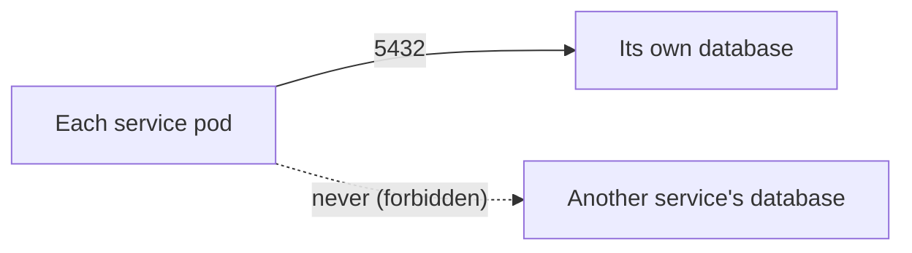

# Database Architecture

**Purpose.** To document the PostgreSQL data model: the 16 logical databases, who owns what,
migrations (Flyway), and how to connect.

## 1. Database-per-service model

Every service owns exactly one PostgreSQL database. This is the core isolation decision of the
platform.

| Service | Database |
|---|---|
| `identity-service` | `identity_db` |
| `organization-service` | `organization_db` |
| `recruiter-service` | `recruiter_db` |
| `candidate-service` | `candidate_db` |
| `interview-service` | `interview_db` |
| `telemetry-service` | `telemetry_db` |
| `policy-engine-service` | `policy_db` |
| `report-service` | `report_db` |
| `notification-service` | `notification_db` |
| `analytics-service` | `analytics_db` |
| `audit-service` | `audit_db` |
| `storage-service` | `storage_db` |
| `feature-flag-service` | `feature_flag_db` |
| `scheduler-service` | `scheduler_db` |
| `integration-service` | `integration_db` |
| `configuration-service` | `configuration_db` |

> `discovery-service` and `api-gateway` are stateless and own **no** database. `desktop-client`
> persists client pairing data in `identity_db`/`interview_db` domain data.

## 2. Where the databases live

| Environment | Implementation | Provisioned by |
|---|---|---|
| `local` / `docker` | Postgres 16 container | `docker-compose.yml` (health-gated) |
| `dev` | Postgres StatefulSet (in-cluster) | `infra/k8s/postgres.yaml` |
| `qa` / `uat` / `prod` | Amazon RDS for PostgreSQL | `terraform/modules/rds` |

The `infra/k8s/postgres.yaml` StatefulSet runs an init Container that creates all 16 databases on
first boot (idempotent — it checks `pg_database` before creating). RDS comes with the databases
created the same way by the provisioning step (`deployment/13-deploy-postgresql.md`).

## 3. Schema and migrations (Flyway)

- Each service holds its Flyway migrations under `services/<service>/src/main/resources/db/migration`.
- Migrations run **on service startup** before the service accepts traffic (Spring Boot Flyway
  integration). `flyway.migrate` is the default behavior.
- Versioned SQL files follow the `V<n>__<description>.sql` convention. Flyway records applied
  versions in the `flyway_schema_history` table per database, so a migration is applied exactly
  once.
- **Checksum protection**: Flyway refuses to start if a previously-applied migration file changed
  (checksum mismatch). This is a safety feature, not a bug — see
  `troubleshooting/README.md` → "Flyway failures".

**Key properties** (see `configuration-reference.md`):

| Property | Meaning |
|---|---|
| `spring.flyway.enabled=true` | Run migrations at startup |
| `spring.datasource.url` | `jdbc:postgresql://<host>:5432/<db>` |
| `spring.datasource.username/password` | From Secrets Manager / env |
| `spring.liquibase.enabled=false` | (not used) |

## 4. Connection model



- Each service connects only to its own database using a dedicated PostgreSQL user (least
  privilege — one user cannot `SELECT` from another service's database).
- In dev/local the DB host is `postgres` (StatefulSet headless service); in prod it is the RDS
  endpoint (e.g. `integrity-prod.cluster-xxxx.us-east-1.rds.amazonaws.com`).
- Connection pool: HikariCP, sized conservatively per service (documented in each service's
  `application-<profile>.yml` and the config layer in `infra/config/`).

## 5. RDS specifics (qa/uat/prod)

| Feature | Setting |
|---|---|
| Engine | PostgreSQL 16 |
| Storage | gp3, encrypted (KMS, key `alias/<project>/rds`) |
| Multi-AZ | prod + uat only |
| Automated backups | enabled, 7-day retention (prod) |
| PITR | enabled (backup window + transaction logs) |
| Deletion protection | enabled on prod |
| Parameter group | tuned (work_mem, shared_buffers, etc. per instance class) |

See `deployment/13-deploy-postgresql.md`, `disaster-recovery.md`, and the runbook
`runbooks/database-failure.md`.

## 6. Operational access

Never connect to the production database from a laptop. Use a session through the cluster
(or the bastion) and the least-privilege credentials:

```bash
# Port-forward the postgres service in dev/local
kubectl -n integrity port-forward svc/postgres 5432:5432

# Then connect
PGPASSWORD=$POSTGRES_PASSWORD psql -h 127.0.0.1 -U integrity -d identity_db
```

For RDS in qa/uat/prod, use the same port-forward pattern through a debug pod, or `aws rds
generate-db-auth-token` with IAM auth if enabled. Never copy production credentials to a laptop.
