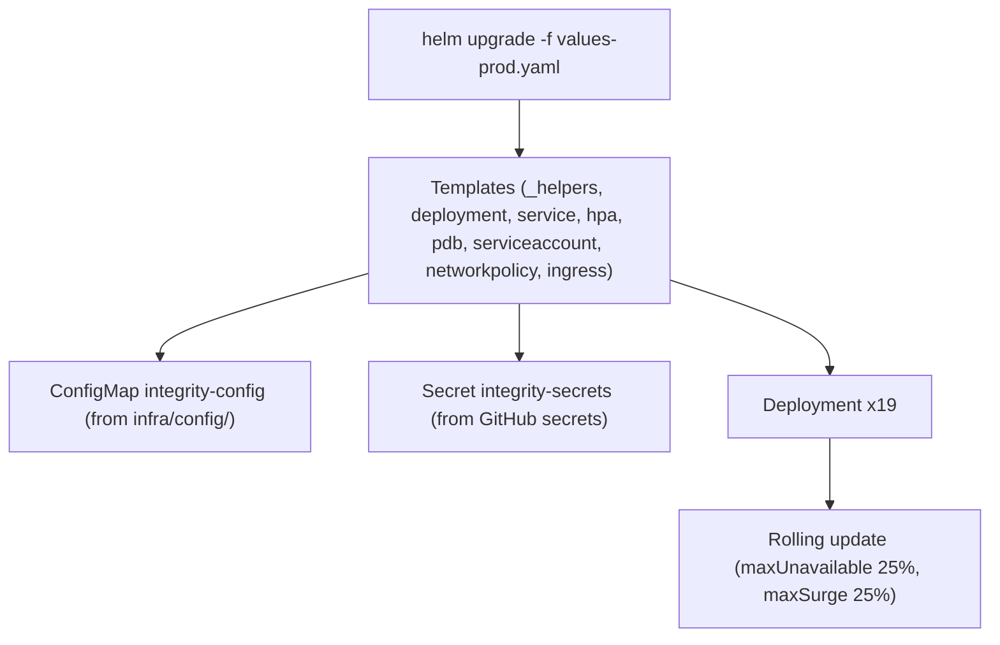
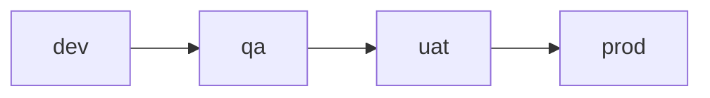

# Deployment Architecture

**Purpose.** To document how a code change flows from a developer's laptop to a running service in
EKS, and how a release is rolled forward and rolled back.

## 1. End-to-end delivery pipeline

```mermaid
flowchart LR
    DEV["Developer commits to feature branch"] --> PR["Pull request to master"]
    PR --> CI["ci.yml: build, test, lint, infra validation"]
    CI -->|"all green"| MERGE["Merge to master"]
    MERGE --> DEP["deploy.yml"]
    MERGE --> TF["terraform.yml (if infra changed)"]
    DEP --> IMG["Build 19 images"]
    IMG --> ECR["Push to ECR per env"]
    ECR --> CFG["Render ConfigMap integrity-config"]
    CFG --> SEC["Render Secret integrity-secrets"]
    SEC --> HELM["helm upgrade interview-integrity"]
    HELM --> ROLL["kubectl rollout status"]
    ROLL --> SMOKE["Smoke test via gateway"]
    SMOKE -->|"failed"| RB["Rollback: helm --reuse-values rollback"]
```



## 2. Workflow files

| Workflow | File | Trigger | What it does |
|---|---|---|---|
| **CI** | `.github/workflows/ci.yml` | PR and push to master | Gradle build/tests, client checks, portal build, `terraform fmt/validate` all roots, `helm lint`/`template`, YAML parse of k8s/compose files |
| **Terraform** | `.github/workflows/terraform.yml` | PR (plan) and merge/approved apply | OIDC role `integrity-<env>-github-actions`; `terraform init/validate/plan` per env on PR; `apply` after GitHub environment approval |
| **Deploy** | `.github/workflows/deploy.yml` | Merge to master | Build and push images per env, render ConfigMap/Secret, `helm upgrade`, rollout status, gateway smoke test, automatic rollback on failure |

## 3. Image strategy

- **Registry**: Amazon ECR. One repository per service per environment, named
  `integrity-<env>/<service>` (see `terraform/modules/ecr/main.tf`).
- **Image URI**: `<account>.dkr.ecr.us-east-1.amazonaws.com/integrity-<env>/<service>`.
- **Tag**: short SHA of the commit, so every image is traceable to a commit.
- **Immutable**: never overwrite a tag; every release is a new tag. This makes rollback to "the
  image from the last known-good commit" trivial.

```yaml
# example values-prod.yaml (abridged)
image:
  repository: "123456789012.dkr.ecr.us-east-1.amazonaws.com/integrity-prod/api-gateway"
  tag: "9cbbf32"
  pullPolicy: "IfNotPresent"
```

## 4. Helm chart topology

`infra/helm/interview-integrity` is the single chart for all workloads. Values are selected per
environment: `values.yaml` (defaults) + `values-{local,dev,qa,uat,prod}.yaml`.

Per service the chart renders:

- `Deployment` (image, probes, resource limits, `envFrom` secrets, config mount)
- `Service` (ClusterIP, fixed port)
- `ServiceAccount` (IRSA annotation)
- `HorizontalPodAutoscaler` (target CPU utilization)
- `PodDisruptionBudget` (minAvailable)
- plus one shared `NetworkPolicy`, `Ingress`, `HPA` wiring.



## 5. Configuration injection

| Source | Contents | Injected via |
|---|---|---|
| `infra/config/*.yaml` (per profile) | Non-secret runtime config, `platform.storage.endpoint`, Kafka bootstrap, DB URLs | ConfigMap `integrity-config`, mounted read-only |
| GitHub Actions secrets | `RDS_PASSWORD`, `JWT_SECRET`, `KAFKA_SCRAM_USER/PASS`, `REDIS_PASSWORD`, etc. | Secret `integrity-secrets` |
| AWS Secrets Manager | The source of truth for prod secrets, read at runtime by services (or injected at deploy time) | IRSA role policy |

**Rule:** secrets never live in Git, ConfigMaps, or Helm values. They exist in Secrets Manager and
are materialized into the Secret object by the deploy pipeline.

## 6. Rollout and rollback

- **Rolling update**: `maxUnavailable: 25%`, `maxSurge: 25%` — a release never takes all pods
  down at once.
- **Readiness gating**: new pods must pass `/actuator/health/readiness` before receiving traffic.
- **Checksum annotation**: the deployment template includes a checksum of the ConfigMap/Secret, so
  changing config triggers a real rollout.
- **Rollback**: `kubectl -n integrity rollout undo deployment/<name>` (imperative) or
  `helm rollback interview-integrity <revision>` with `--reuse-values` (pipeline default).

See the runbook [`runbooks/service-rollback.md`](../runbooks/service-rollback.md).

## 7. Environment promotion



Promotion is **image + values** based, not rebuild-based:

1. Build once in CI (`deploy.yml`) for each target environment.
2. The same image SHA is deployed to dev, then qa, then uat, then prod (with approval gates).
3. Differences between environments are only in `values-<env>.yaml` and the profile config in
   `infra/config/`.

Because images are immutable and config is versioned, "prod runs exactly what uat ran" is
provable by comparing image tags.

## 8. Deployment design decisions

| Decision | Rationale |
|---|---|
| One umbrella Helm chart | One `helm upgrade` per release; version skew between 19 services impossible in a release |
| ConfigMap/Secret rendered by pipeline, not chart | Keeps secrets out of Helm values and charts trivially reviewable |
| Immutable image tags | Rollback is a tag lookup, not a rebuild |
| Deploy pipeline owns rollout status | Failures are caught in the pipeline, not at 2 a.m. |
| Approval-gated environments | qa/uat/prod require explicit GitHub environment approval before apply/deploy |
