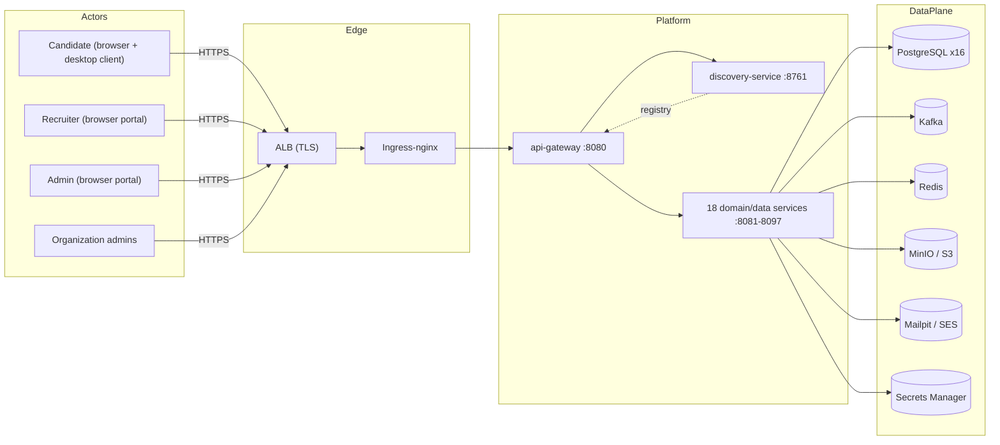

# High-Level Architecture

**Purpose.** To give every reader — including non-engineers — a single mental model of the
Integrity Pro platform before they read any other document.

## 1. The platform in one picture

## 2. Components explained

| Component | What it is | Why it exists |
|---|---|---|
| **Candidates** | The people being interviewed. Use the Rust desktop client (with embedded browser, telemetry, screen-share, camera, microphone) and the browser for the interview itself. | The desktop client is the integrity enforcement point. |
| **Recruiters / Admins** | Users of the React portals. | Drive interviews, review reports, manage policy. |
| **API gateway** (`:8080`) | Single reactive entry point; routes every request to the right service; the only public backend port. | Simplifies auth, CORS, routing, and hardening (one attack surface instead of 19). |
| **Discovery service** (`:8761`) | Netflix-Eureka-compatible registry. Every service registers itself; the gateway and services resolve each other by name. | Enables dynamic routing and horizontal scaling without hard-coded URLs. |
| **18 domain/data services** (`:8081`–`:8097`) | Identity, organization, recruiter, candidate, interview, desktop-client, telemetry, policy-engine, report, notification, analytics, audit, storage, feature-flag, scheduler, integration, configuration, and the platform services. | Each owns exactly one bounded context and one database. |
| **PostgreSQL** | 16 logical databases (each service gets its own). | Data isolation and independent scaling of the data tier. |
| **Kafka** | Event backbone; carries domain events (interviews created, telemetry received, policy violations, etc.). | Decouples producers from consumers and enables replay. |
| **Redis** | Cache and ephemeral session data. | Reduces database load for hot reads. |
| **MinIO / S3** | Object storage for documents, reports, and uploads. | Durable, cheap, S3-API-compatible storage. |
| **Mailpit / SES** | Email sink (local/dev) and transactional email (prod). | Delivers notifications in dev without an inbox; SES in prod. |
| **Secrets Manager** | JWT keys, DB credentials, Kafka SCRAM credentials. | Central, auditable, rotated secrets. |

## 3. The data plane split

The same logical data plane is implemented two ways depending on environment:

| Capability | `local` / `dev` (in-cluster / compose) | `qa` / `uat` / `prod` (AWS managed) |
|---|---|---|
| PostgreSQL | Postgres container / StatefulSet | Amazon RDS for PostgreSQL |
| Kafka | Strimzi Kafka operator | Amazon MSK |
| Redis | Redis container / Deployment | Amazon ElastiCache for Redis |
| Object storage | MinIO | Amazon S3 |
| Email | Mailpit | Amazon SES |

The application is unaware of the switch — only `SPRING_PROFILES_ACTIVE` and the
`platform.storage.endpoint` / `spring.kafka.bootstrap-servers` / datasource / redis URL
configuration change. See `configuration-reference.md` and `database-strategy.md`.

## 4. Design principles

1. **Every environment is identical in shape** — only size and managed-vs-self-hosted differs.
2. **No Java code changes between environments** — promotion is a config diff.
3. **The gateway is the only ingress** — services are never exposed directly.
4. **Each service owns its database** — no shared schema, no cross-service SQL.
5. **Events, not REST, connect critical paths** — telemetry and interview state flow through Kafka
   so consumers can catch up and replay.
6. **Infrastructure is versioned code** — Terraform + Helm + GitHub Actions, reviewed like any
   pull request.

## 5. What the high-level diagram deliberately omits

- VPC / subnet layout → see [`networking.md`](networking.md).
- The 19 individual services and their ports → see [`microservices.md`](microservices.md).
- How an interview flows end-to-end → see [`sequence.md`](sequence.md).
- The Kubernetes control plane and namespaces → see `kubernetes.md` in the docs root.
- Threat model and controls → see [`security.md`](security.md).
