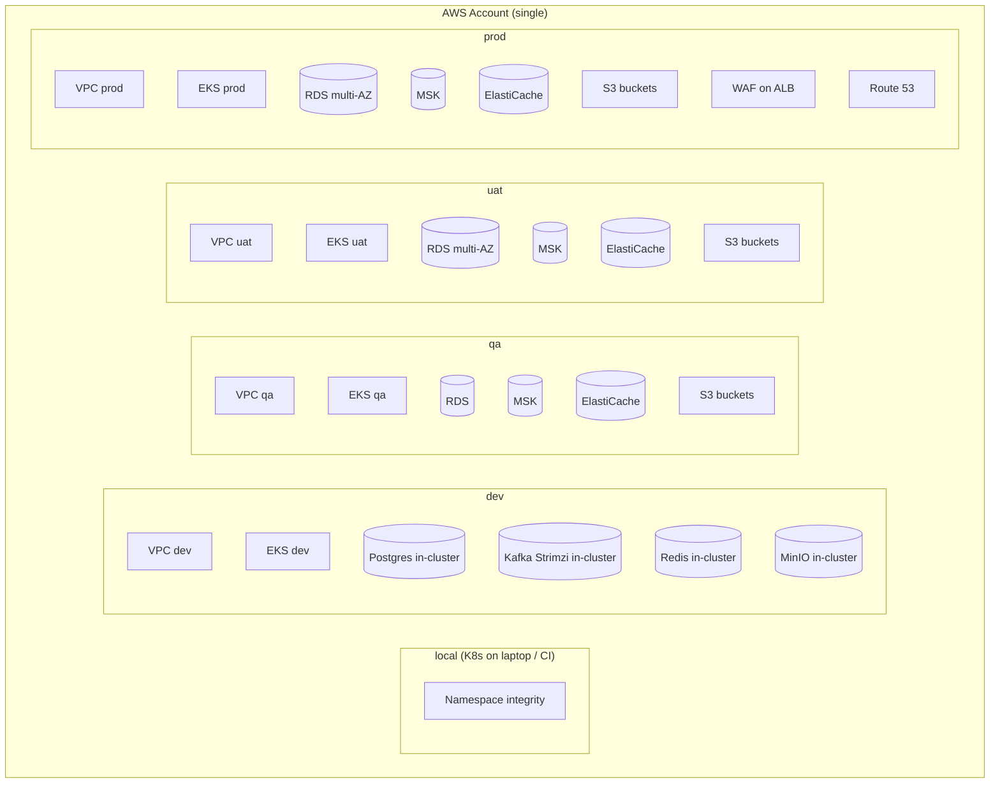
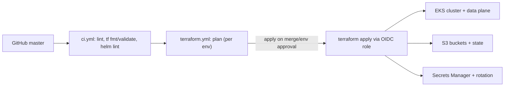

# Infrastructure Architecture

**Purpose.** To document the AWS infrastructure that runs Integrity Pro, the environment layout,
and the Terraform structure that owns it.

## 1. Environment layout



Each environment (`dev`, `qa`, `uat`, `prod`) is a **separate VPC** with its own EKS cluster,
data plane, S3 buckets and Secrets Manager secrets. There is **no shared mutable state** between
environments except the Terraform state bucket and the ECR repositories.

## 2. Per-environment sizing

| Dimension | dev | qa | uat | prod |
|---|---|---|---|---|
| EKS nodes | 2–6 | 3–9 | 3–12 | 6–15 |
| Node instance | managed node group | managed node group | managed node group | managed node group |
| RDS instance | `db.t4g.medium` | `db.t4g.medium` | `db.m6i.large` | `db.m6i.xlarge` |
| RDS multi-AZ | no | no | yes | yes |
| MSK | no | yes | yes | yes |
| WAF | no | no | no | yes |
| Secrets rotation | no | no | no | yes |
| Object storage | MinIO (in-cluster) | S3 | S3 | S3 |

> `local` runs entirely on a laptop: in-cluster Postgres/Redis/Kafka(Strimzi)/MinIO/Mailpit or the
> Docker Compose equivalents. `dev` uses the same in-cluster data plane on EKS to keep costs near
> zero while exercising real Kubernetes behavior.

## 3. AWS services used and why

| AWS service | Module | Why |
|---|---|---|
| **S3** (`terraform/modules/s3`) | shared bucket, state bucket, object storage buckets | Durable object storage; state backend; `documents`/`reports`/`uploads`. |
| **DynamoDB** (bootstrap) | state locking | `terraform` lock table prevents concurrent applies. |
| **KMS** (`terraform/modules/kms`) | encryption keys | Envelope encryption for state, secrets, EBS, S3, RDS. |
| **VPC** (`terraform/modules/vpc`) | networking | Isolated network per environment. |
| **EKS** (`terraform/modules/eks`) | Kubernetes control plane | Managed K8s; IRSA for pod credentials. |
| **RDS** (`terraform/modules/rds`) | PostgreSQL | Managed, multi-AZ, automated backups, PITR. |
| **MSK** (`terraform/modules/kafka`) | Kafka | Managed Kafka on qa/uat/prod; SASL/SCRAM auth. |
| **ElastiCache** (`terraform/modules/redis`) | Redis | Managed, clustered Redis. |
| **ECR** (`terraform/modules/ecr`) | image registry | Repository per service per environment. |
| **Secrets Manager** (`terraform/modules/secrets-manager`) | secrets | JWT, DB, Kafka credentials with rotation. |
| **Parameter Store** (`terraform/modules/parameter-store`) | config values | Non-secret config pushed to clusters. |
| **ALB** (`terraform/modules/alb`) | ingress controller target | Ingress-nginx front door. |
| **ACM** (`terraform/modules/acm`) | TLS certificates | Signed certificates for ALB/ingress. |
| **Route 53** (`terraform/modules/route53`) | DNS | `*.yourdomain.com` → ALB. |
| **CloudWatch** (`terraform/modules/cloudwatch`) | logs/metrics/alarms | Centralized logs and operational alarms. |
| **IAM** (`terraform/modules/iam`) | identities | Least-privilege roles for nodes, pods, CI. |
| **Monitoring** (`terraform/modules/monitoring`) | Prometheus/Grafana infra | Optional operator-run observability stack. |

## 4. Terraform root structure

```text
terraform/
├── bootstrap/                  # One-time: S3 state bucket + DynamoDB lock table
├── account/                    # One-time: GitHub OIDC provider + CI roles
├── environments/
│   ├── local/                  # apply-able? no (laptop), used for reference
│   ├── dev/                    # full EKS stack, in-cluster data plane
│   ├── qa/                     # EKS + RDS + MSK + ElastiCache + S3
│   ├── uat/                    # + multi-AZ RDS
│   └── prod/                   # + WAF, rotation, multi-AZ everything
├── modules/                    # 19 reusable modules
│   ├── shared/ iam/ kms/ vpc/ networking/ s3/ ecr/ rds/ redis/ kafka/
│   ├── secrets-manager/ parameter-store/ eks/ alb/ acm/ route53/
│   └── cloudwatch/ monitoring/
└── README.md
```

Each environment root is a thin composition:

- `main.tf` — wires modules together.
- `providers.tf` — AWS + Kubernetes + Helm providers.
- `backend.tf` — remote state in `s3://integrity-<env>-tfstate` (dev/qa/uat/prod).
- `variables.tf` / `locals.tf` — inputs and derived values.
- `outputs.tf` — cluster name, endpoint, kubeconfig instructions.
- `terraform.tfvars` — **not committed** (`.gitignore`'d); copy from `terraform.tfvars.example`.

## 5. State and locking

| Concern | Design |
|---|---|
| State location | `s3://<env-bucket>/<env>/terraform.tfstate` per environment |
| Encryption | SSE-KMS, key alias `alias/<project>/terraform-state` |
| Locking | DynamoDB table `terraform-locks` with `LockID` primary key |
| CI access | OIDC role `integrity-<env>-github-actions` (see `terraform/account`) |

State is **never** stored locally after bootstrap. `terraform plan`/`apply` always read the lock
table first, which prevents two engineers from applying to the same environment at once.

See `terraform.md` in the docs root for full detail, and `terraform/README.md` for bootstrap steps.

## 6. Delivery pipeline (infrastructure side)



Infrastructure changes are planned in every PR and applied only after the GitHub environment
approval gate passes. See `deployment/08-provision-aws-infrastructure.md` and the `terraform.yml`
workflow.
