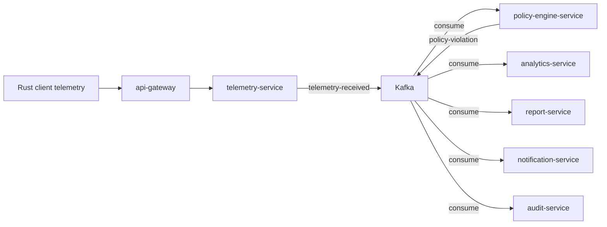

# Kafka Architecture

**Purpose.** To document the event backbone: topics, producers, consumers, and how the same
topology runs on Strimzi (local/dev) and Amazon MSK (qa/uat/prod).

## 1. Role of Kafka

Kafka decouples the critical telemetry path from the API. A service that *produces* an event
never waits for consumers. A consumer can be down, catch up, or replay without affecting
producers. This is what makes telemetry ingestion burst-safe and the policy/report pipeline
independently scalable.

## 2. Topics

All topics are created by Terraform (MSK) or the Strimzi `KafkaTopic` CRs
(`infra/k8s/kafka-strimzi.yaml`). **Auto-creation is disabled** on the broker — topics must exist
before any producer writes to them.

| Topic | Producer | Consumers | Content |
|---|---|---|---|
| `identity-user-registered` | `identity-service` | audit, notification, analytics | New user registered |
| `identity-user-updated` | `identity-service` | audit, analytics | User profile changed |
| `identity-email` | `identity-service` | `notification-service` | Email request |
| `organization-registered` | `organization-service` | audit, analytics | New org created |
| `candidate-registered` | `candidate-service` | audit, notification, analytics | Candidate + consent |
| `interview-created` | `interview-service` | audit, notification, analytics | Interview created |
| `interview-scheduled` | `interview-service` | notification, scheduler | Interview scheduled |
| `interview-started` | `interview-service` | policy-engine, telemetry, analytics | Interview began |
| `interview-completed` | `interview-service` | report-service, analytics | Interview ended |
| `telemetry-received` | `telemetry-service` | `policy-engine-service`, analytics | Raw client telemetry |
| `telemetry-received-dlq` | (dead-letter) | ops tooling | Poison telemetry messages |
| `policy-violation` | `policy-engine-service` | report, notification, audit, analytics | Policy breach detected |
| `report-generated` | `report-service` | notification, analytics | Report finished |

## 3. Topology (same shape everywhere)



## 4. Runtime split

| Environment | Broker | Auth | Notes |
|---|---|---|---|
| `local` / `docker` | Strimzi Kafka in Docker (or compose `kafka`) | PLAIN (dev only) | Single node, for developers |
| `dev` | Strimzi Kafka operator, in-cluster | PLAIN (inside cluster) | Same operator/manifests as local |
| `qa` / `uat` / `prod` | **Amazon MSK** | SASL/SCRAM (`SCRAM-SHA-512`) | Managed brokers, 3 AZs (prod) |

The application picks the right bootstrap address and auth via configuration only
(`spring.kafka.bootstrap-servers`, `spring.kafka.properties.sasl.*`), so no code changes are
needed to move from Strimzi to MSK. The full migration procedure is documented in
[`kafka-msk-migration.md`](../kafka-msk-migration.md).

## 5. Message reliability

| Concern | Setting |
|---|---|
| Producer acks | `acks=all` (in-flight durability) |
| `enable.idempotence` | `true` (no duplicates) |
| `min.insync.replicas` | `2` on prod (topic replication factor 3) |
| Consumer group | one per consuming service (e.g. `policy-engine-service`) |
| Auto-commit | disabled; offsets committed after processing |
| Dead-lettering | `telemetry-received-dlq` for poison messages, with alerting |
| Retention | prod topic retention tuned per topic (hours for telemetry, days for domain events) |

## 6. Operational commands

```bash
# List topics (local/dev, inside cluster)
kubectl -n kafka exec -it kafka-0 -- bin/kafka-topics.sh --bootstrap-server localhost:9092 --list

# Describe a topic's offsets/lag
kubectl -n kafka exec -it kafka-0 -- bin/kafka-get-offsets.sh --bootstrap-server localhost:9092 --topic telemetry-received

# Check consumer group lag
kubectl -n kafka exec -it kafka-0 -- bin/kafka-consumer-groups.sh \
  --bootstrap-server localhost:9092 --describe --group policy-engine-service
```

On MSK these run through the MSK CLI (`aws kafka ...`) or from a broker bastion; the broker
`bootstrap-brokers` value is available from the Terraform outputs of the environment.

## 7. Common failure modes (full detail in runbooks)

| Symptom | Likely cause | Runbook |
|---|---|---|
| `LEADER_NOT_AVAILABLE` at startup | Brokers still joining, or topic not created | `runbooks/kafka-failure.md` |
| Consumers never receive events | Consumer group stuck / rebalance loop | `runbooks/kafka-failure.md` |
| Lag grows without bound | Consumer can't keep up (too few replicas) | `runbooks/kafka-failure.md`, scaling |
| SASL auth errors on prod | SCRAM secret rotated but pods not restarted | `runbooks/secret-rotation.md` |
| Messages on the DLQ | Serialization/validation failure | Inspect DLQ, fix producer, replay |
