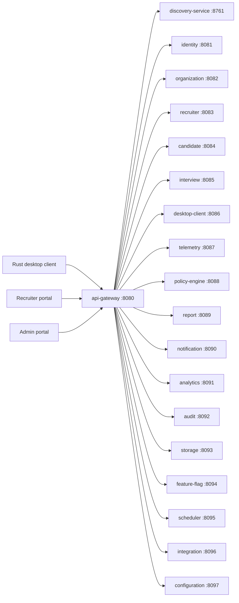

# Microservice Architecture

**Purpose.** To document the 19 services, what each does, which port it listens on, which database
it owns, and how they call each other.

## 1. Service inventory

Services are declared in `settings.gradle.kts`. Each is a Java 21 / Spring Boot 4.1 **reactive**
(WebFlux) service in `services/<name>`. They register with `discovery-service` at startup.

| # | Service | Port | Responsibility | Owns database |
|---|---|---|---|---|
| 1 | `discovery-service` | 8761 | Eureka-compatible registry; all services register here | `discovery` |
| 2 | `api-gateway` | 8080 | Reactive gateway; single public entry point; routes to services | `gateway` |
| 3 | `identity-service` | 8081 | Login, JWT issue/refresh, tokens, user identities | `identity` |
| 4 | `organization-service` | 8082 | Organizations, tenants, memberships, org settings | `organization` |
| 5 | `recruiter-service` | 8083 | Recruiters, hiring teams, pipelines | `recruiter` |
| 6 | `candidate-service` | 8084 | Candidates, profiles, consent records | `candidate` |
| 7 | `interview-service` | 8085 | Interview lifecycle: schedule, state machine, events | `interview` |
| 8 | `desktop-client-service` | 8086 | Desktop client pairing, version, upgrade policy | `desktop_client` |
| 9 | `telemetry-service` | 8087 | Ingests telemetry from the desktop client, validates, forwards to Kafka | `telemetry` |
| 10 | `policy-engine-service` | 8088 | Policy definitions and evaluation; violation detection | `policy_engine` |
| 11 | `report-service` | 8089 | Integrity reports; renders and stores reports | `report` |
| 12 | `notification-service` | 8090 | Email and in-app notifications | `notification` |
| 13 | `analytics-service` | 8091 | Aggregations and analytics over events | `analytics` |
| 14 | `audit-service` | 8092 | Immutable audit trail of platform events | `audit` |
| 15 | `storage-service` | 8093 | Object storage (MinIO/S3): documents, reports, uploads | `storage` |
| 16 | `feature-flag-service` | 8094 | Feature flags and experimentation toggles | `feature_flag` |
| 17 | `scheduler-service` | 8095 | Scheduled jobs: expiry, reminders, cleanup, batch | `scheduler` |
| 18 | `integration-service` | 8096 | External system integrations (ATS, calendars) | `integration` |
| 19 | `configuration-service` | 8097 | Dynamic application configuration for clients | `configuration` |

> **Port rule.** The gateway is always 8080. Domain services increment by one from 8081 to 8097.
> The registry is 8761. These port numbers are also used in the Helm chart and Docker Compose, so
> they must stay stable.

## 2. Inter-service communication

**Key rules**

1. External callers (portals, client, browsers) only ever reach the **gateway**. The gateway looks
   up the destination instance via the discovery service.
2. Services that need other services use the discovery service to resolve the target by logical
   name (e.g. `http://identity-service`), never a hard-coded IP.
3. Events flow through **Kafka** (see [`kafka.md`](kafka.md)); the telemetry, policy, report,
   notification, analytics, and audit services are primarily event consumers.
4. Every service calls **only its own database**. Cross-database reads are forbidden.

## 3. Startup and ordering

The `scripts/run-services.sh` script enforces startup order locally:

1. Infrastructure (Postgres, Redis, Kafka, MinIO, Mailpit) — via Docker Compose.
2. `discovery-service` — the registry must be up first.
3. `api-gateway` — it must discover the registry.
4. All other services — started in parallel, each health-checked via `/actuator/health` before the
   next stage proceeds.

In Kubernetes the ordering is handled by the Helm chart and readiness probes; a service is only
routed traffic once it reports `READY` on `/actuator/health/readiness`.

## 4. Health, readiness and liveness

Every service exposes Spring Boot Actuator endpoints:

| Endpoint | Purpose | Used by |
|---|---|---|
| `/actuator/health` | Overall health summary | Manual checks, run-services script |
| `/actuator/health/readiness` | Ready to receive traffic | Kubernetes readiness probe |
| `/actuator/health/liveness` | Process alive | Kubernetes liveness probe |
| `/actuator/info` | Build/version info | Tooling |

## 5. Common concerns handled in shared libraries

Shared logic lives in `libs/` and is applied consistently across services:

- `libs/api-contract` — shared DTOs and contract types.
- `libs/security` — JWT validation, filter chain, role extraction.
- `libs/event-contracts` — Kafka event schema/types.
- `libs/common` — common web components and utilities.

This is why the services stay small: business logic only, with infrastructure concerns shared.

## 6. Design decisions (see `decisions.md` for full ADRs)

| Decision | Rationale |
|---|---|
| Reactive (WebFlux) everywhere | Consistent non-blocking behavior under telemetry burst load. |
| One DB per service | Independent schema evolution, scaling, and blast radius. |
| Eureka-style registry | Uniform discovery across compose, K8s, and cloud. |
| Gateway-only ingress | Single auth/CORS/hardening point. |
| Ports fixed per service | Simplifies compose, Helm, and local tooling; no dynamic port assignment. |
