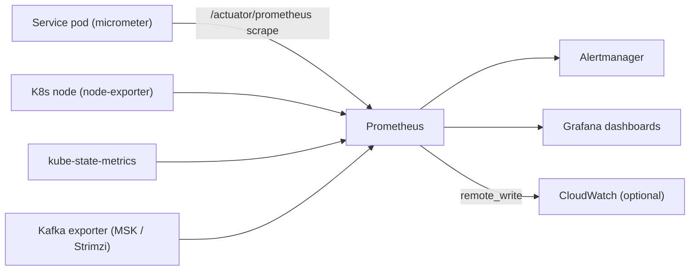
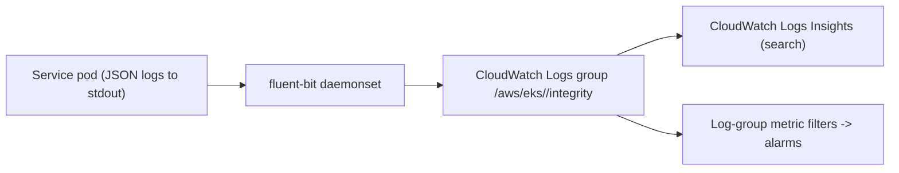
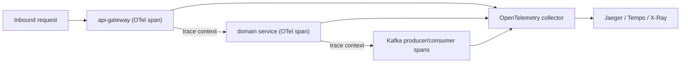

# Monitoring Architecture

**Purpose.** To document how Integrity Pro is observed: metrics, logs, traces, dashboards and
alerts, and which tools own each layer.

## 1. Observability pillars

| Pillar | Tool | Signals |
|---|---|---|
| **Metrics** | Prometheus + Grafana (CloudWatch metrics as secondary) | CPU, memory, request rates, error rates, latency, HPA targets, Kafka lag, JVM heap |
| **Logs** | CloudWatch Logs (Amazon EKS/Ops), service logs to stdout → fluent-bit → CloudWatch | Structured JSON logs per service |
| **Traces** | OpenTelemetry SDK → Jaeger (or ADOT → X-Ray in prod) | Distributed traces across gateway → service → Kafka |
| **Alerts** | Alertmanager (Prometheus) + CloudWatch Alarms | paging and dashboard alarms |
| **Dashboards** | Grafana | Per-service and platform-wide dashboards |

## 2. Metric flow



- Every Spring Boot service exposes Prometheus metrics via `micrometer-registry-prometheus`
  (`/actuator/prometheus`).
- Prometheus scrapes pods via the `prometheus.io/scrape` annotations on the Helm chart.
- Custom business metrics are exported by the services under `integrity_*` (e.g.
  `integrity_telemetry_received_total`, `integrity_policy_evaluations_total`).

## 3. Log flow



- All services log structured JSON to stdout (no log files inside the container).
- `fluent-bit` (or the CloudWatch agent on EKS) ships them to CloudWatch Logs.
- Log groups are per cluster/environment; retention is set by `terraform/modules/cloudwatch`.
- Query logs with **CloudWatch Logs Insights**, e.g.:

```bash
# search a service for exceptions in the last 15 minutes
fields @timestamp, @message
| filter @logStream like "identity-service"
| filter @message like /ERROR|Exception/
| sort @timestamp desc
| limit 100
```

## 4. Tracing flow



- Distributed tracing is enabled with the OpenTelemetry agent/JDK. Trace IDs propagate through
  HTTP headers and Kafka headers, so a single user request is traceable gateway → service → broker.
- Jaeger is deployed in dev/local; production uses the AWS Distro for OpenTelemetry (ADOT) writing
  to X-Ray or a self-hosted Jaeger, whichever the `monitoring` module configures.

## 5. Alerting rules (examples)

| Alert | Expression (PromQL) | Severity |
|---|---|---|
| Pod down | `kube_deployment_status_replicas_available < desired` for 5m | critical |
| High error rate | `sum(rate(http_server_requests_seconds_count{status=~"5.."}[5m])) / sum(rate(http_server_requests_seconds_count[5m])) > 0.05` | page |
| Kafka consumer lag | `kafka_consumergroup_lag > 10000` for 10m | page |
| DB connections | `hikaricp_connections_active >= hikaricp_connections_max * 0.9` | warn |
| Certificate expiry | `certmanager_certificate_expiration_timestamp_seconds - time() < 14d` | page |

These are implemented in the `monitoring` Terraform module (CloudWatch alarms) and/or the
Prometheus rule files shipped with the observability stack.

## 6. Dashboards

| Dashboard | Content |
|---|---|
| **Platform overview** | All services: up/down, request rate, error rate, p95 latency |
| **Per-service** | JVM heap, thread count, Hikari pool, HTTP metrics, actuator health |
| **Kafka** | Broker health, topic throughput, consumer lag, partitions |
| **PostgreSQL** | Connections, cache hit ratio, replication lag (RDS metrics) |
| **Node / cluster** | Node CPU/mem, pods per node, network policies active |

Dashboards are provisioned with the Grafana stack (Terraform `monitoring` module) and can be
exported/imported via Grafana's JSON model.

## 7. Operational cadence

1. **On-call pager**: critical alerts (pod down, DB down, Kafka lag, 5xx spike).
2. **Warn channel**: near-threshold conditions, cert expiry < 14 days, disk > 80%.
3. **Weekly review**: error-rate trends, capacity planning, Kafka lag baselines.
4. **Every incident**: write/update a runbook (see `runbooks/`) and add a dashboard where it
   helps.

## 8. Security notes

- Scrape endpoints are only reachable in-cluster (network policies + service annotations); the
  Prometheus server is never exposed to the internet.
- CloudWatch log groups and alarms are encrypted with KMS.
- Grafana auth uses the identity provider configured by the monitoring module (OAuth2/OIDC), never
  the default `admin/admin`.
