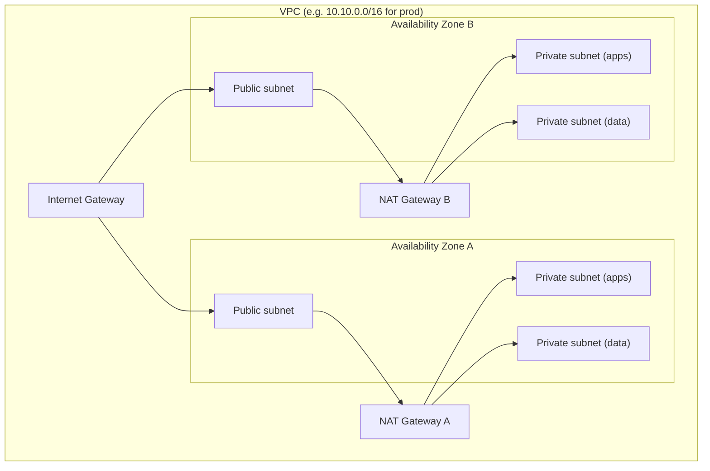
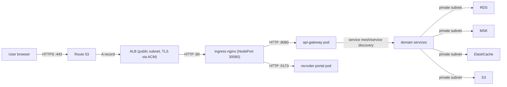

# Networking Architecture

**Purpose.** To document the network topology: VPC layout, subnets, security groups, how traffic
reaches the platform, and how workloads are isolated inside the cluster.

## 1. VPC layout

Each environment owns a VPC (see `terraform/modules/vpc`). The CIDR is per-environment to keep
peering and CIDR conflicts impossible.

| Subnet tier | Contains | Internet access |
|---|---|---|
| **Public** | ALB, NAT gateways, bastion (if enabled) | Direct via IGW |
| **Private (apps)** | EKS node groups, ingress-nginx | Outbound via NAT |
| **Private (data)** | RDS, MSK, ElastiCache | Outbound via NAT, no inbound from internet |

**Why three tiers.** Data stores must never be reachable from the internet. Applications need
outbound internet (image pulls, SES, S3). Only the ALB needs inbound internet. Splitting
app/data subnets means security groups and NACLs can be tightened independently.

## 2. Traffic path from a user's browser

1. DNS: Route 53 `*.yourdomain.com` resolves to the ALB.
2. TLS terminates at the ALB with an ACM certificate (`443` → `80`).
3. Ingress-nginx receives the request on the NodePort (port `30080`).
4. Ingress rules split traffic:
   - `api.yourdomain.com` → `api-gateway` (`:8080`).
   - `app.yourdomain.com` → recruiter portal.
5. The gateway discovers and calls services by logical name (Eureka).
6. Services reach the data plane over private subnets only.

## 3. Security groups

| Security group | Allows | Denies |
|---|---|---|
| ALB SG | inbound `443` (internet) | everything else |
| ingress-nginx (NodePort) | inbound `30080` from ALB SG | internet |
| EKS nodes SG | inbound from ALB SG on NodePort; inbound within cluster; outbound all | internet inbound |
| RDS SG | inbound `5432` from EKS nodes/app SG only | internet |
| MSK SG | inbound `9092/9094` (SASL) from app SG only | internet |
| ElastiCache SG | inbound `6379` from app SG only | internet |

**Why this matters.** Even if a pod were compromised, lateral movement is bounded: the pod can
only reach the databases that the security groups allow, over the ports that the network policies
allow (see section 5).

## 4. In-cluster service networking

- Every service has a **Kubernetes Service** (ClusterIP) named after the service
  (e.g. `api-gateway`, `identity-service`).
- Pods resolve each other via **CoreDNS** — `http://identity-service` inside the
  `integrity` namespace.
- The discovery service registers **logical names + ports**, so the gateway routes by name even
  when pod IPs change.

## 5. Network policies (default deny)

`infra/k8s/network-policy.yaml` enforces **zero-trust inside the cluster**:

| Policy | Effect |
|---|---|
| Default-deny ingress (namespace `integrity`) | Nothing reaches a pod unless another policy allows it |
| Default-deny egress | Pods cannot call the internet unless allowed |
| Allow ingress from ingress-nginx | Only the ingress controller can reach app pods |
| Allow egress to DNS (`kube-dns`) | Name resolution works |
| Allow egress to Kafka | Producers/consumers can reach the broker network |
| Allow egress to internet (via NAT) | Image pulls, SES, S3, MSK bootstrap |

**Why.** Kubernetes by default allows all pod-to-pod traffic. Network policies are the primary
control that bounds what a compromised workload can do.

## 6. DNS design

| Name | Type | Target | Purpose |
|---|---|---|---|
| `api.<env>.yourdomain.com` | A/ALIAS | ALB DNS | Public API |
| `app.<env>.yourdomain.com` | A/ALIAS | ALB DNS | Recruiter portal |
| `admin.<env>.yourdomain.com` | A/ALIAS | ALB DNS | Admin portal |
| `*.local`, service names | Cluster | CoreDNS | In-cluster resolution |

See `deployment/18-configure-domain.md` for the exact steps.

## 7. Common mistakes

| Mistake | Symptom | Fix |
|---|---|---|
| DB SG allows `0.0.0.0/0` | Internet can probe RDS | Scope SG to app CIDR/security group |
| No egress policy for DNS | Pods fail with `getaddrinfo` errors | Allow egress to `kube-dns` |
| NAT gateway in one AZ only | Dev outage when that AZ fails | One NAT per AZ (already the default here) |
| NodePort firewalled | ingress health checks fail | Allow ALB SG → NodePort `30080` |
