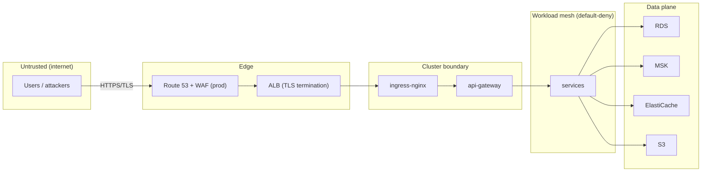

# Security Architecture

**Purpose.** To document the defense-in-depth controls protecting Integrity Pro, and how each
layer maps to a threat. This is the reference for the [`security.md`](../security.md) operational
guide.

## 1. Trust boundaries

Every arrow is a control point:

| Boundary | Control |
|---|---|
| Internet → edge | WAF (prod), TLS 1.2+ only, ACM certs |
| Edge → cluster | ALB security group scoped to ALB only; NodePort 30080 firewalled |
| Ingress → gateway | AuthN/AuthZ in `libs/security` (JWT), gateway validates tokens |
| Pod → pod | Network policies: default-deny ingress and egress |
| Pod → data plane | Security groups per data store; per-service DB users; SASL/SCRAM for MSK |
| Pod → AWS APIs | IRSA: each workload gets the narrowest IAM role |

## 2. Identity and access management

| Layer | Mechanism |
|---|---|
| Humans (AWS console/CLI) | IAM users/roles, MFA required, least privilege (see `deployment/02-create-iam-user.md`) |
| CI/CD (GitHub) | **OIDC** federation — no long-lived AWS keys in GitHub; role `integrity-<env>-github-actions` |
| Kubernetes pods | **IRSA** (`eks.amazonaws.com/role-arn` on ServiceAccount) — pods assume AWS roles, never inherit node permissions |
| Application users | JWT (access short-TTL + refresh) validated in `libs/security` |
| DB / Kafka / Redis | Dedicated credentials in Secrets Manager, per-service users |

**Why OIDC instead of keys?** A long-lived access key committed to CI is a standing compromise.
With OIDC the pipeline requests a short-lived token per run, scoped to one environment role.

## 3. Secrets management

| Secret | Storage | Rotation |
|---|---|---|
| JWT signing key | AWS Secrets Manager (`alias` per env) | 90 days, prod |
| RDS master + per-service passwords | Secrets Manager | Lambda rotation, prod |
| MSK SCRAM credentials | Secrets Manager | manual + Lambda, prod |
| Redis password | Secrets Manager | manual |
| `integrity-secrets` (cluster) | Kubernetes Secret materialized from Secrets Manager by the deploy pipeline | on rotation |

Rules:

1. No secrets in Git, ConfigMaps, Helm values, or image layers.
2. Secrets Manager is encrypted with a per-env KMS key; access is IAM-scoped (IRSA).
3. Kubernetes Secrets are encrypted at rest (EKS encryption provider, KMS key).
4. Rotate before a credential could leak: any suspected exposure → rotate immediately
   (runbook `runbooks/secret-rotation.md`).

## 4. Certificates and TLS

| Cert | Issuer | Renewal |
|---|---|---|
| ALB listener cert | AWS ACM (public) | automatic by ACM |
| Ingress certs (`*.yourdomain.com`) | ACM | automatic by ACM |
| In-cluster mTLS (service mesh, if enabled) | cert-manager | automatic |
| Client ↔ gateway | Public TLS | via ACM/Route 53 |

- TLS terminates at the ALB; the ALB → ingress link is HTTP inside the VPC but never leaves AWS.
- Minimum TLS version 1.2; prod enforces 1.3 if the client policy allows.
- Certificates are monitored (`certmanager_certificate_expiration` / CloudWatch alarm) so renewal
  is never a surprise. See `runbooks/certificate-renewal.md`.

## 5. Network policies (cluster) — see `networking.md`

- Default-deny ingress and egress in namespace `integrity`.
- Allow only: ingress-nginx → pods; DNS egress; Kafka egress; NAT egress for external APIs.
- This bounds lateral movement: a compromised telemetry pod cannot scan the cluster or reach RDS
  on its own.

## 6. Security groups (AWS) — see `networking.md`

- Data stores: inbound only from the app security group on the service port, no internet.
- Node groups: no inbound from internet except ALB → NodePort.
- NACLs as a coarse second layer; SGs as the fine-grained control.

## 7. Encryption

| At rest | Mechanism |
|---|---|
| S3 buckets | SSE-S3 or SSE-KMS (per-env KMS key) |
| EBS volumes | EKS-managed, KMS key `alias/<project>/ebs` |
| RDS / MSK / ElastiCache | KMS keys per service |
| Secrets Manager / Parameter Store | KMS |
| Kubernetes Secrets | EKS encryption provider |
| State bucket (S3) + DynamoDB lock | SSE-KMS; DynamoDB is encrypted by default |

| In transit | Mechanism |
|---|---|
| User → ALB | TLS (ACM) |
| Pod → pod | mTLS optional (Istio/Linkerd) — today cluster-internal trust via network policies + service identity |
| Pod → RDS/MSK/ElastiCache | TLS where supported (RDS `ssl`, MSK SASL/TLS, Redis TLS) |
| Pod → S3/SES | HTTPS endpoints |

## 8. Runtime security

- Containers run as non-root (`runAsNonRoot`), read-only root filesystem where the image allows.
- `securityContext` drops all Linux capabilities.
- Images are built from distroless/minimal bases; `deploy.yml` uses content digests.
- Pods have resource limits (CPU/memory) so a runaway consumer cannot starve the node.
- Audit of platform actions is written by `audit-service` to its own database (immutable append).

## 9. Threat model summary

| Threat | Control |
|---|---|
| Internet attacker scans RDS/Redis | Data stores in private subnets, SGs deny internet |
| Compromised pod lateral movement | Default-deny network policies |
| Stolen CI credentials | OIDC short-lived tokens, per-env roles |
| Stolen JWT | Short TTL access tokens + revocable refresh tokens in Redis |
| Secret in Git | Secrets Manager + `trufflehog`/gitleaks in CI + `.gitignore` |
| Data exfiltration | Default-deny egress, S3 access via IRSA scoped to own buckets, audit logs |
| TLS interception | TLS everywhere, pinned ACM certs, HSTS headers on ingress |
