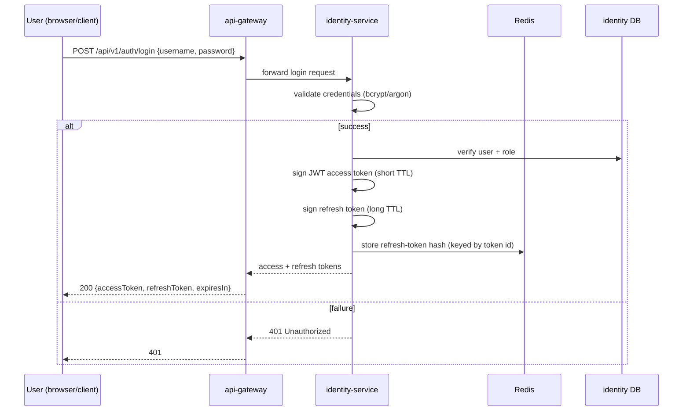
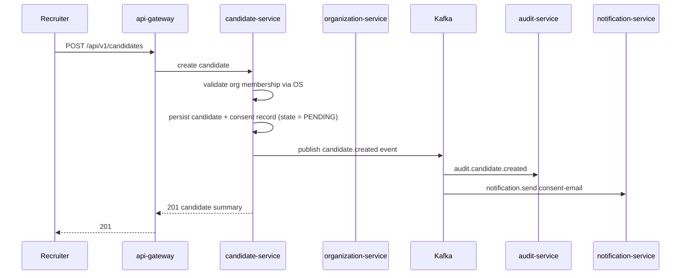
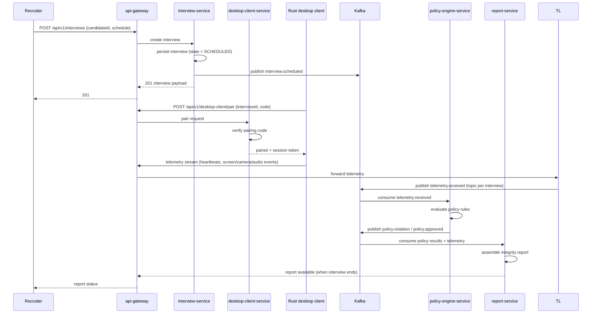
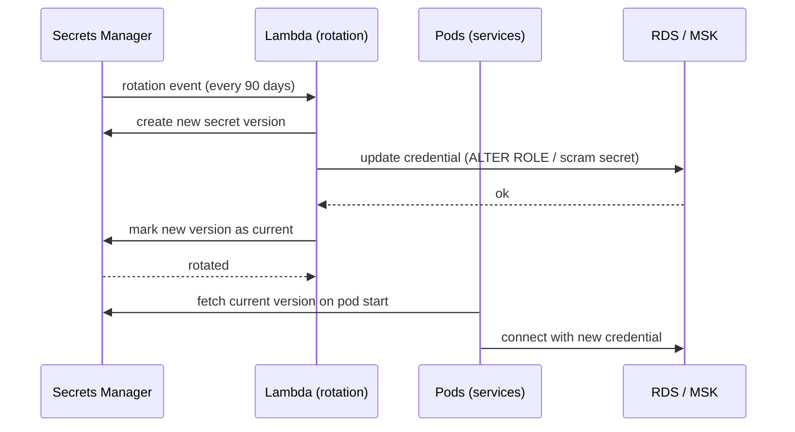

# Sequence Diagrams

**Purpose.** To show how the platform behaves at runtime for the most important flows. These
diagrams are also the reference for load-testing, debugging, and on-call triage.

## 1. Login / authentication flow

**Notes**
- The gateway is the only component that ever sees credentials.
- Access tokens are short-lived and validated in `libs/security` on every request (stateless).
- Refresh tokens are validated against Redis, which lets the platform revoke sessions instantly.

## 2. Candidate onboarding (consent flow)

**Notes**
- The candidate record is only considered active once consent is recorded (`candidate.consent`).
- Downstream actions (audit, notification) happen via Kafka, so they never block the API response.

## 3. Interview lifecycle

**Notes**
- Telemetry is **fire-and-forget** to Kafka; the client never blocks on policy evaluation.
- The policy engine is a pure event consumer, so it can be scaled independently.
- The report service produces the human-readable integrity report at interview end.

## 4. Secrets rotation

**Notes**
- Rotation applies to prod (and is available for uat); the JWT signing key is rotated by issuing a
  new KMS/SM version and updating the `integrity-secrets` Secret, followed by a rolling restart.
- Runbooks: `runbooks/secret-rotation.md`, `runbooks/password-rotation.md`.

## 5. How to read these diagrams when debugging

| Symptom | Which sequence to look at | First thing to check |
|---|---|---|
| User cannot log in | §1 | Is `identity-service` healthy? Is Redis reachable (refresh tokens)? |
| Candidate email never arrives | §2 | Is the `candidate.created` event on Kafka? Is `notification-service` consuming? |
| No integrity report at interview end | §3 | Is telemetry reaching Kafka? Is `policy-engine-service` consuming? |
| Services can't authenticate to DB after rotation | §4 | Did the rotation Lambda update the DB before marking the version current? |
