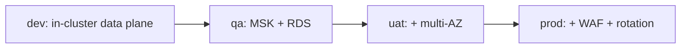

# Best Practices

**Purpose.** The standards every contributor follows: how we write code, ship it, version it,
promote it, and operate it. These are the "ways of working" that keep Integrity Pro reliable as
it grows.

## 1. Coding standards

| Area | Standard |
|---|---|
| Language/runtime | Java 21 (backend), Node 24 (portals), Rust 2021 (client) — versions pinned by tooling |
| Backend style | Reactive (WebFlux); shared logic in `libs/`; no environment-specific code |
| No comments unless they explain *why* | Code says what; comments say why |
| Config | Externalize via `${ENV_VAR:default}`; never hard-code environment values |
| Tests | `./gradlew check` must pass; new services/library code ships with tests |
| Ports | Fixed per service (`microservices.md` §1); never change without updating compose + Helm + docs |
| Migrations | New Flyway version per change; **never edit an applied migration** (`flyway-failures.md`) |
| Formatting | `terraform fmt -recursive`, `npm run lint`, `prettier`, `cargo fmt` — enforced in CI |

## 2. Git workflow

### Branch strategy

- `master` is the only long-lived branch; it is always deployable.
- Feature work: `git checkout -b <date>-feat-<description>-<issue>` (or the team's existing
  convention).
- Hotfix: `git checkout -b <date>-fix-<description>-<issue>` from `master`.

### Commit messages

```text
<type>(<scope>): <imperative summary>

- bullet of what changed
- bullet of why
```

Types: `feat`, `fix`, `chore`, `refactor`, `docs`, `test`, `ci`, `infra`. Example:
`feat(identity): add refresh-token revocation endpoint`.

### Pull request rules

- One logical change per PR; small enough to review in one sitting.
- CI must be green; the PR shows the Terraform plan (if infra changed).
- Description links the issue and notes any runbook/doc updates.
- No force-pushes to `master`; merges are squash or merge as the team decides.

## 3. Release strategy

- **Trunk-based**: small PRs to `master`; releases are a tag + image set, not a branch.
- A **release** = one commit SHA → one set of immutable images (`<sha>` tags) → a Helm release
  revision per environment.
- Release notes record: image SHAs per service, config diffs, migration versions, Helm revisions,
  and runbook changes.

## 4. Versioning

| Artifact | Version scheme | Notes |
|---|---|---|
| Application | `major.minor.patch` (e.g. `1.0.0` in `application.yml`/`Chart.yaml`) | SemVer; breaking API = major |
| Docker images | `<git-sha>` tags | Immutable, traceable |
| Helm chart | `Chart.yaml` `version` | Bump on any chart change |
| Terraform | pinned in `versions.tf` (`~> 1.9.0`) | Upgrade deliberately |
| Migrations | `V<n>__*.sql` | Monotonic per database |

Never overwrite a tag or version; append new ones.

## 5. Deployment standards

1. **Build once, promote the same artifact** — images are built at the commit, never rebuilt per
   environment.
2. **Environment order** — `dev` → `qa` → `uat` → `prod`, each gated.
3. **Health-gated rollouts** — readiness probes and the pipeline's rollout+smoke sequence; never
   `--force` a release past a failing check.
4. **Config is code** — every config change goes through `infra/config/` and the chart, reviewed
   like code.
5. **Secrets never in code** — Secrets Manager is the source of truth
   (`security.md` §3).

## 6. Infrastructure management

- **IaC only** — no console click-ops; Terraform owns everything (`terraform.md`).
- **Plan before apply** — review the diff; never blind-apply in prod.
- **State hygiene** — remote state, locked, versioned, KMS-encrypted; never local for envs.
- **One environment at a time** — dev first, prod last, with rollback rehearsed.
- **Naming** — `integrity-<env>-<resource>` everywhere (buckets, roles, repos, secrets).
- **Tags** — owner/cost-center/env on every resource for cost and ownership clarity.

## 7. Environment promotion



| Rule | Why |
|---|---|
| Same image SHA across all environments | "Prod runs what uat ran" is provable |
| Differences only in `values-<env>.yaml` + profile config | Promotion is a config diff |
| Approve each gate explicitly (GitHub environments) | Human checkpoint before prod |
| Verify each environment with `deployment/17-verify-platform.md` | Catch regressions at the cheapest point |
| Never promote straight to prod | Exceptions need a written change ticket |

## 8. Operational checklist (every release + weekly)

```text
[ ] CI green on master
[ ] dev deployed, rollout + smoke passed
[ ] images pushed for qa/uat/prod (same SHA)
[ ] migrations applied cleanly (flyway history success=t)
[ ] qa -> uat -> prod approved and verified
[ ] dashboards back to baseline (error rate, latency, lag)
[ ] release notes recorded (SHAs, config, migrations, revisions)
[ ] runbooks updated if behavior changed
[ ] secrets/buckets/state backups verified this week
```

## 9. Security practices (summary — full guide: `security.md`)

- Least privilege; OIDC for CI; MFA for humans.
- Rotate secrets on a schedule and after any exposure.
- Default-deny network policies; private data plane.
- Encrypt everything at rest and in transit.
- Scan images; treat critical vulnerabilities as release blockers.

## 10. Documentation practices

- Change behavior → update the relevant doc in the **same PR**.
- Incidents → add/improve a runbook the same shift.
- Commands in docs must be copy-pasteable (no secrets, no unmentioned placeholders).

## 11. When to deviate

Deviations require a written exception with an owner and a date, captured in the ADR log
(`architecture/decisions.md`). Good practices bend to reality; undocumented drift is how systems
die.
