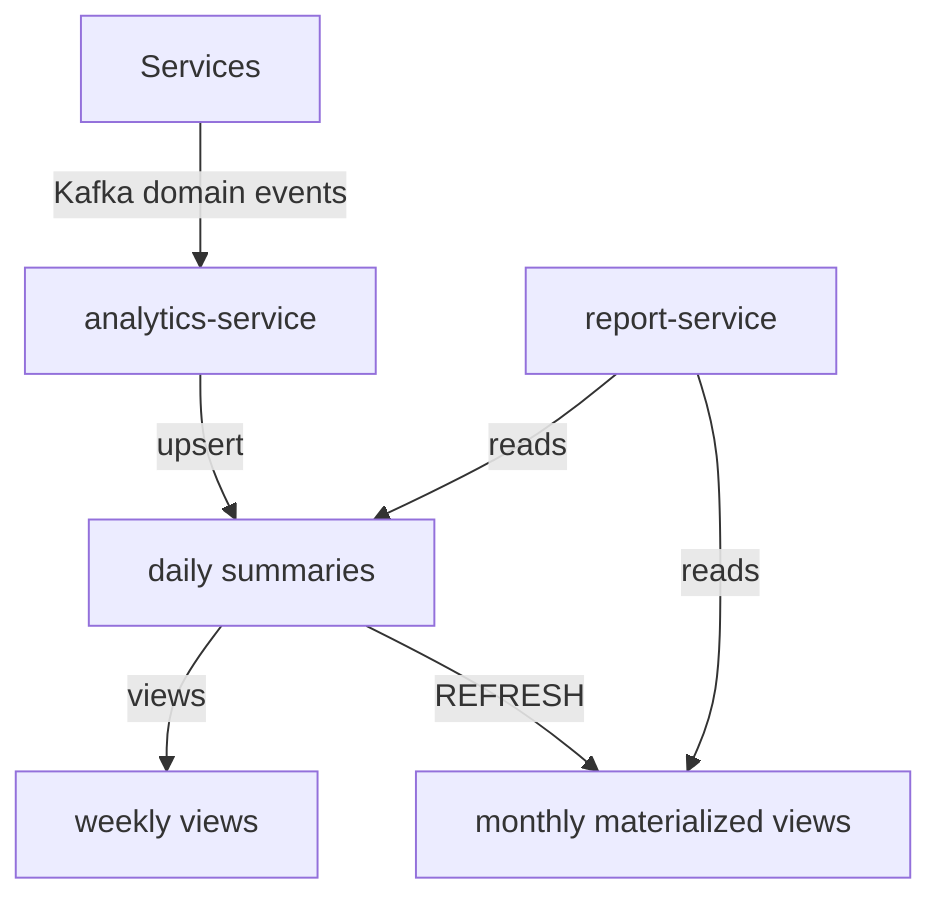

# Analytics & Aggregations

## Purpose

Raw data lives in the owning databases (`telemetry_events`, `violations`,
`interviews`, ...). Dashboards and reports must not scan raw data, so the
analytics-service maintains **pre-aggregated summaries** in `analytics_db`.

## Data flow (event-driven aggregation)

1. Services publish domain events (interview completed, telemetry rolled up,
   violation detected) to Kafka.
2. The analytics-service consumes them and upserts `daily_*` summaries.
3. Weekly views aggregate the daily tables on read.
4. Scheduler-service periodically runs `analytics_refresh_monthly_views()`.

## Summary tables

| Table | Grain | Measures |
|-------|-------|----------|
| `daily_organization_summaries` | day x org | interviews scheduled/completed/cancelled, active candidates/recruiters, violations, avg integrity score |
| `daily_recruiter_summaries` | day x org x recruiter | interviews held/completed, candidates contacted, avg feedback rating, violations |
| `daily_candidate_summaries` | day x org x candidate | interviews attended, avg score, assessments completed, violations |
| `daily_interview_summaries` | day x org x interview | duration, integrity score, violations, status |
| `daily_integrity_summaries` | day x org | total events, violations total + by severity/rule (JSONB), sessions started/abandoned, avg heartbeat cadence |

Weekly rollups are views:

- `weekly_organization_summaries`
- `weekly_recruiter_summaries`
- `weekly_integrity_summaries`

Monthly rollups are materialized views (`WITH NO DATA`, refreshed by job):

- `mv_monthly_organization_summaries`
- `mv_monthly_integrity_summaries`

## Denormalization decision (documented)

Daily summaries denormalize counters into wide rows **by design**: the
trade-off is intentional and documented here because it is the one exception
to the 3NF rule. Rationale:

- **Performance requirement**: interactive dashboards must return in
  milliseconds over billion-row raw datasets; per-row counts make that a
  point lookup on a primary key.
- **Storage**: a day x org x recruiter row is ~150 bytes; a large enterprise
  tenant yields thousands of rows/day - negligible vs raw telemetry.
- **Consistency**: summaries are idempotently rebuilt from Kafka events, so a
  corruption or missed event is repaired by replay rather than by recomputing
  raw data.
- **JSONB counters** (`violations_by_severity`, `violations_by_rule`) store
  small, bounded maps; they remain queryable via GIN if needed.

No other table in the platform is denormalized.

## Aggregation jobs

| Job | Schedule | Function / consumer | Notes |
|-----|----------|---------------------|-------|
| Telemetry hourly rollup | hourly + repair pass | `telemetry_rollup_hour()` | idempotent upsert |
| Daily summary build | every 15 min + EOD | analytics-service (Kafka) | upsert via `analytics_upsert_organization_daily()` |
| Monthly matview refresh | 1st of month 02:00 | `analytics_refresh_monthly_views()` | sequential refresh |
| Telemetry matview refresh | hourly | `REFRESH MATERIALIZED VIEW mv_telemetry_event_type_stats` | - |
| Partition provisioning | daily | `telemetry_ensure_partitions(3)` | pre-create next 3 months |
| Retention (telemetry/audit) | daily | `telemetry_drop_partition_before()` / audit detach | per policy |

Jobs are registered in `scheduler_db.scheduled_jobs`; `analytics_job_runs`
records each run for observability. A `pg_cron`-based deployment is supported
for installations without the scheduler-service.

## Integrity scoring

`avg_integrity_score` is computed by report-service from the weighted severity
model: INFO/LOW = -3, MEDIUM = -8, HIGH = -18, CRITICAL = -35 off a 100 base
(floor 0), identical to the monolith's scoring. Scores are stored per interview
(`daily_interview_summaries.integrity_score`) and averaged per tenant.

## Late-arriving data

Telemetry events may arrive hours late. The rollup job runs a repair pass
(recompute the last 24 hourly buckets) to fold late events into summaries, and
daily summaries are re-upserted from the latest hour buckets so a late day
converges without manual intervention.
