# ER Diagrams

Mermaid `erDiagram` views per database. `||--||` = one-to-one,
`||--o{` = one-to-many, `}o--o{` = many-to-many. Soft cross-database
references are noted in comments and carry no FK edge.

## identity_db

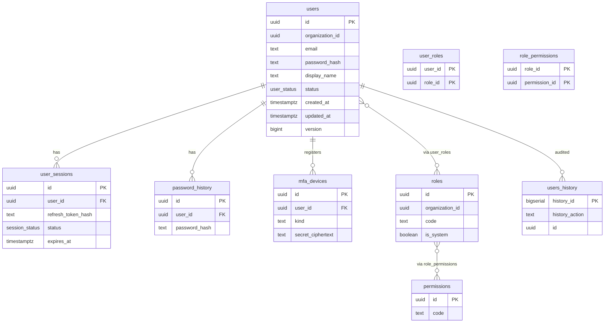

## organization_db

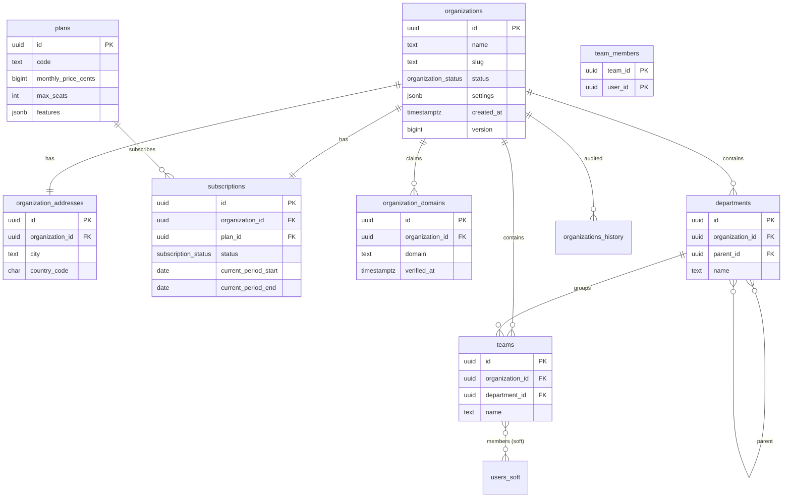

## candidate_db

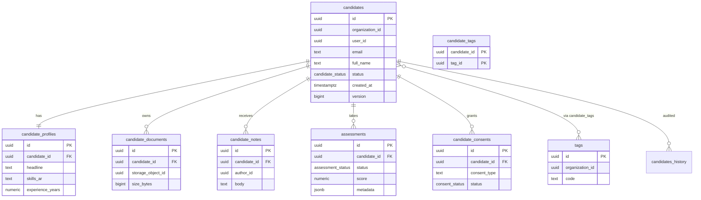

## interview_db

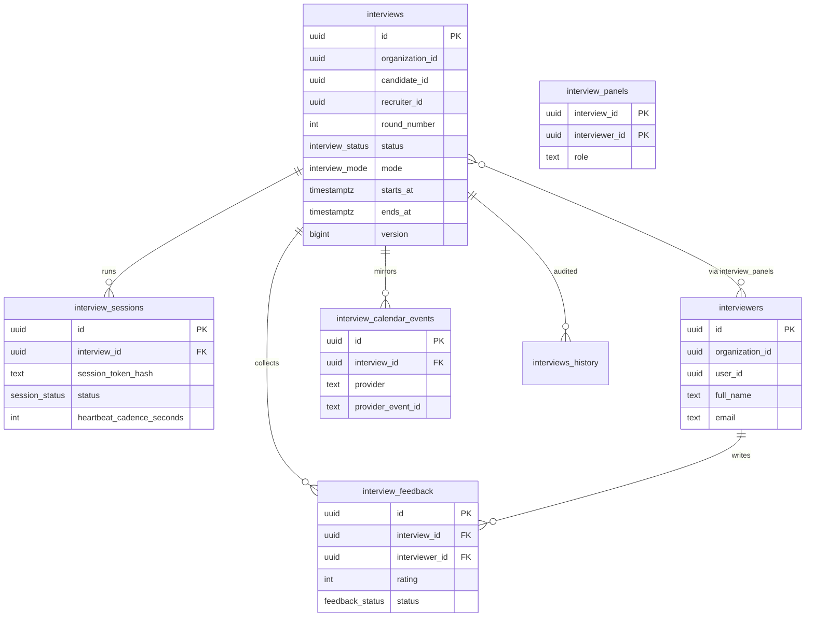

## telemetry_db

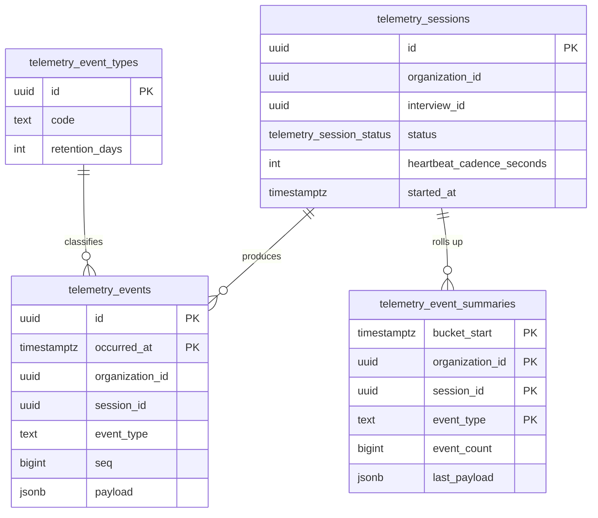

## policy_db

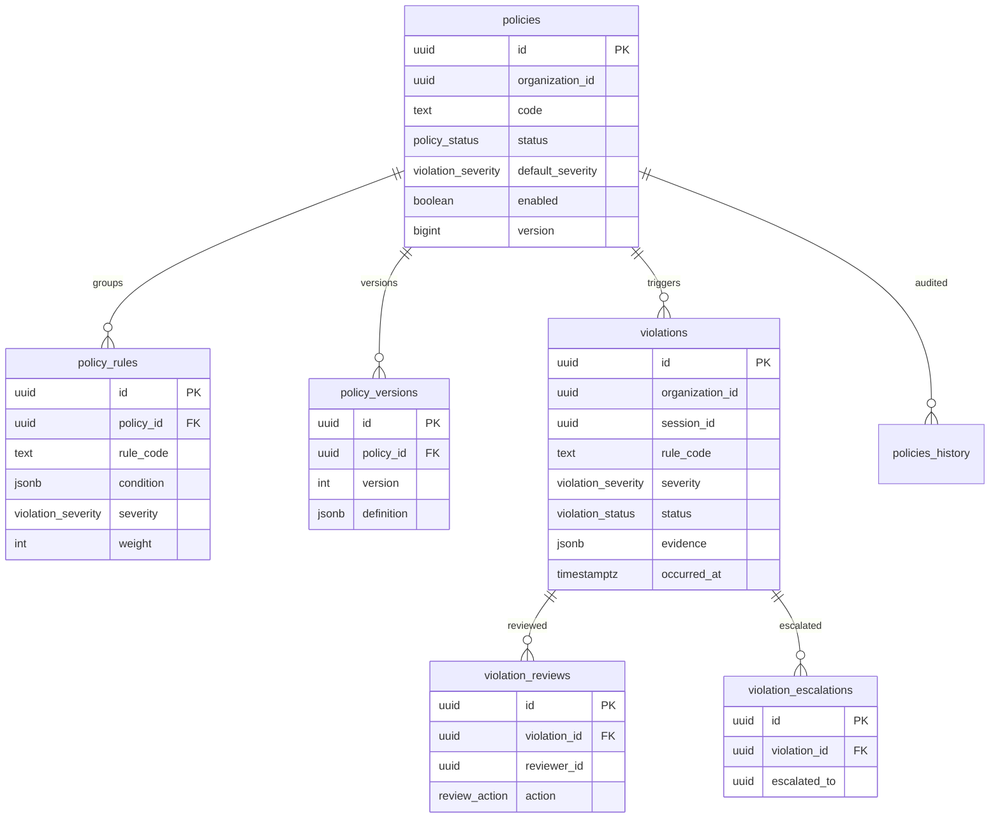

## audit_db

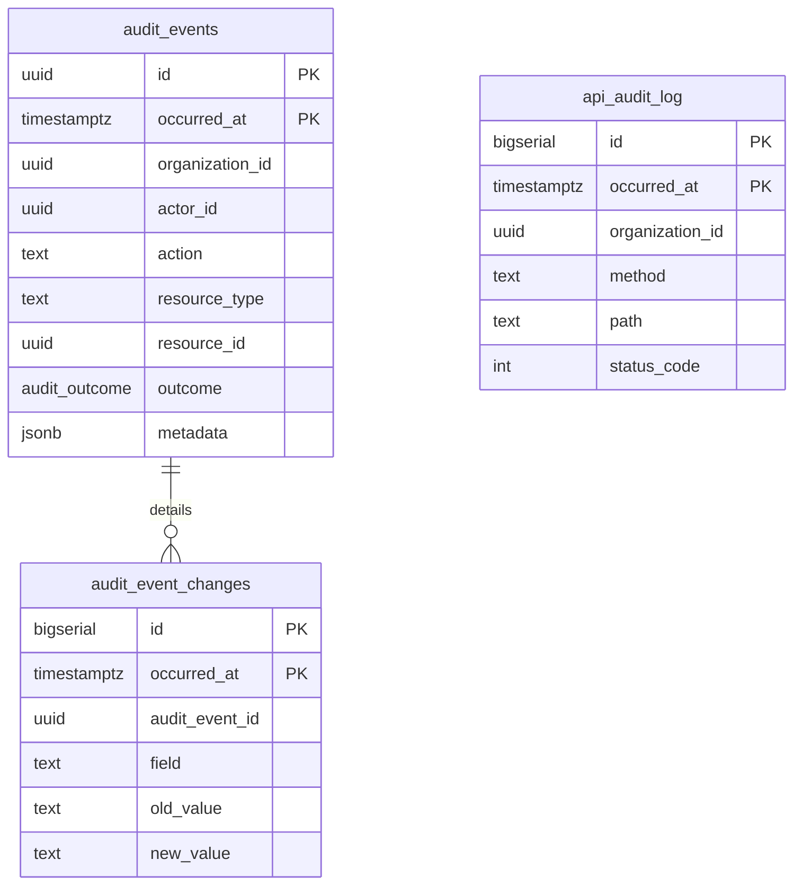

## notification_db / report_db / storage_db / feature_flag_db / scheduler_db / integration_db / configuration_db / analytics_db

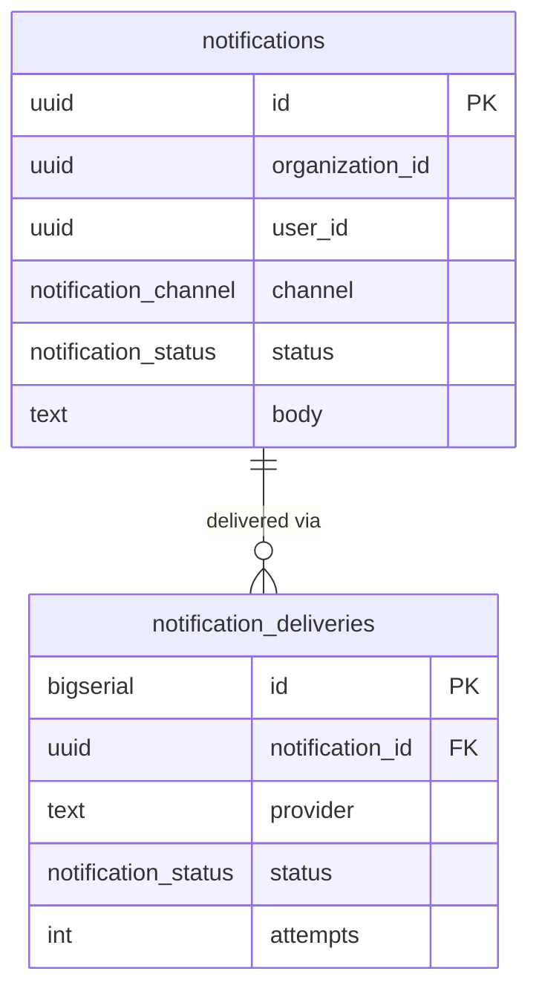

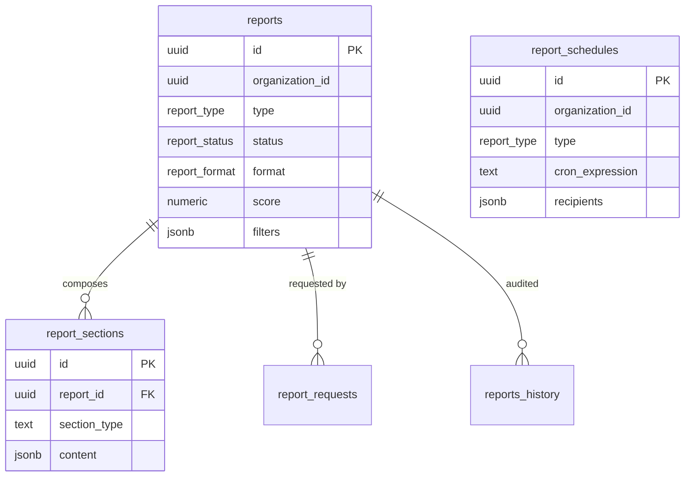

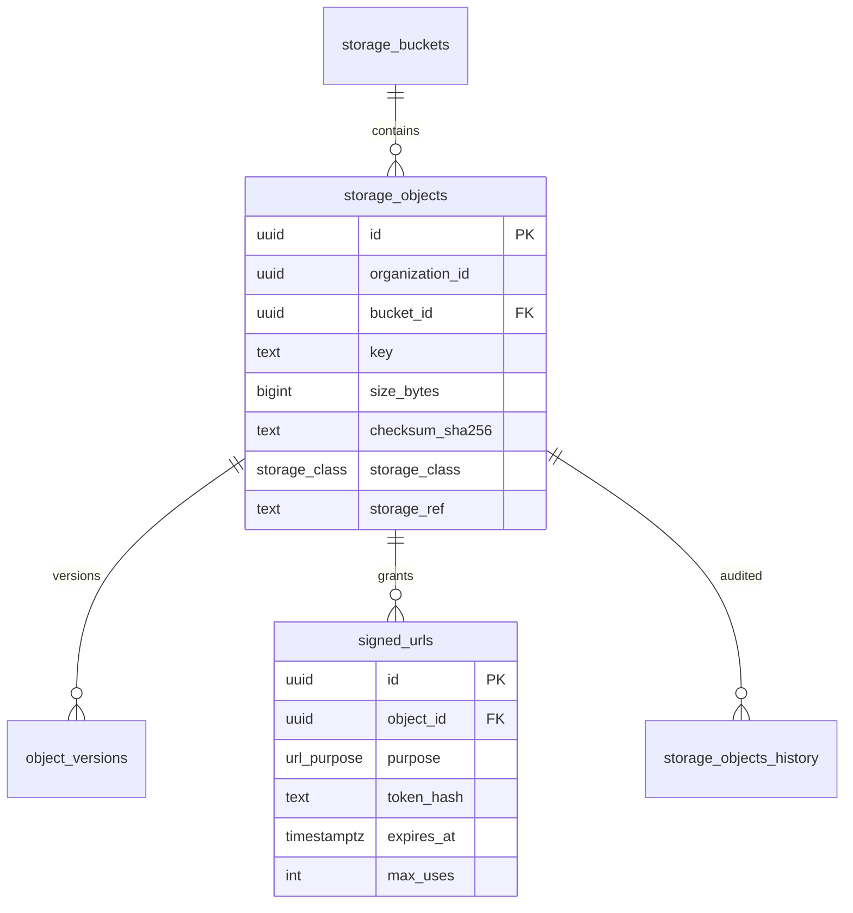

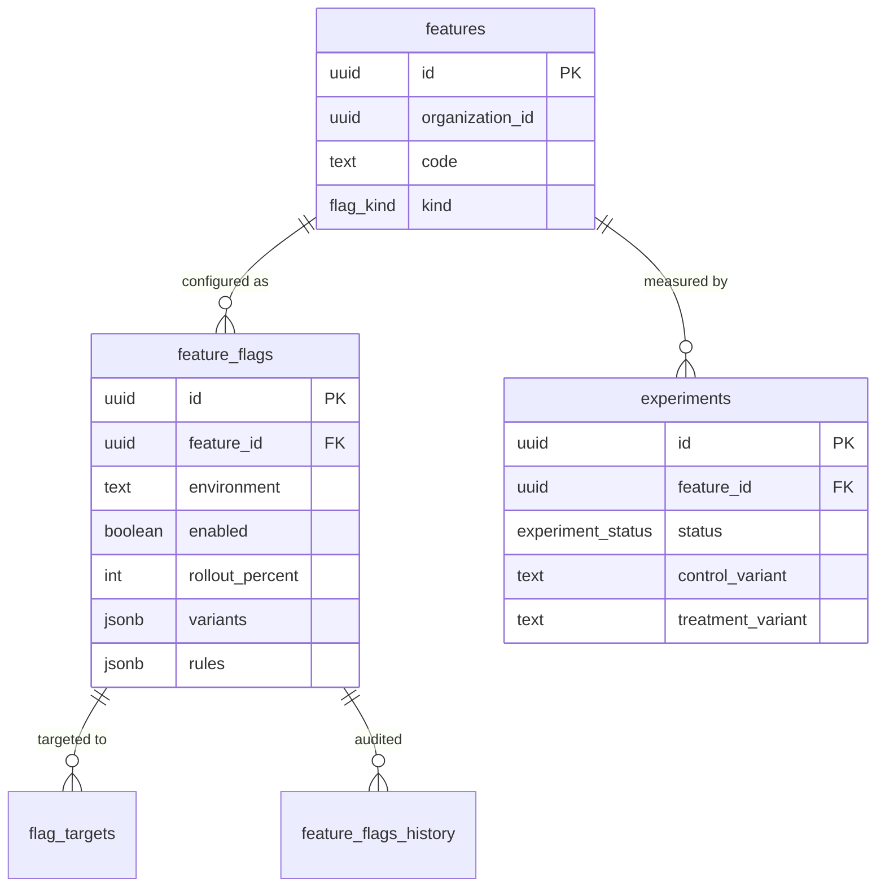

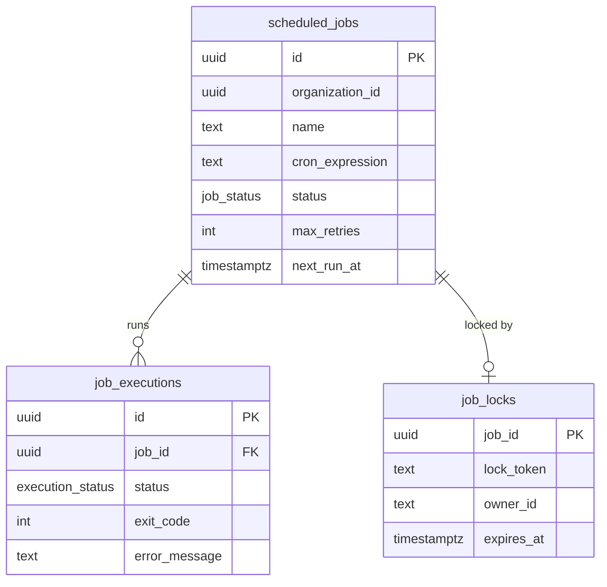

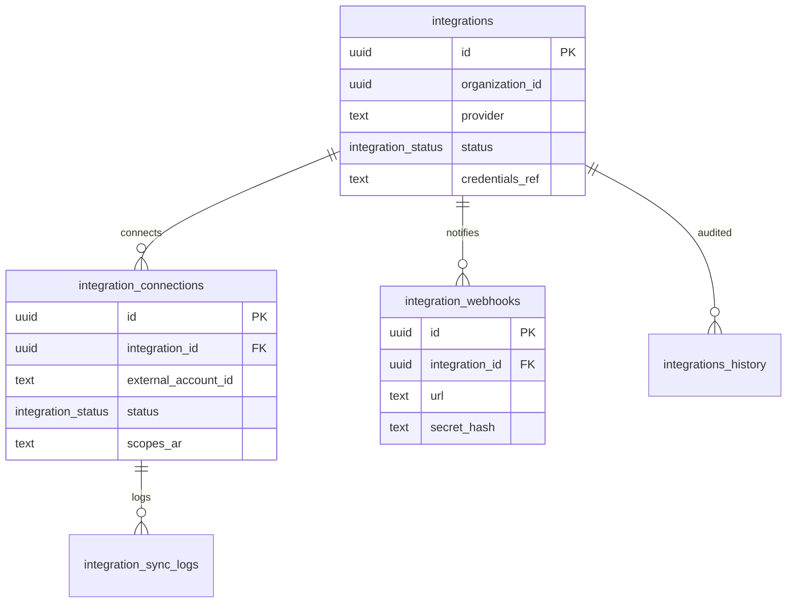

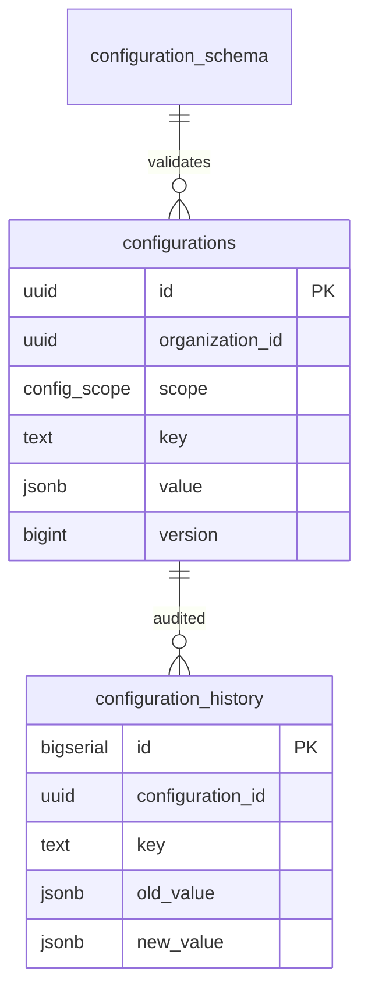

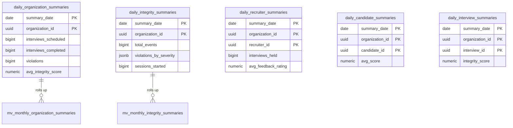
