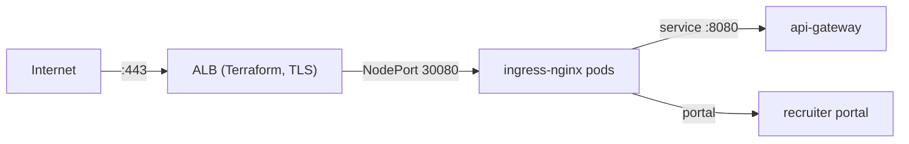

# 16 — Deploy the Ingress (ingress-nginx + ALB)

**Purpose.** To install the ingress controller (ingress-nginx) and put the platform behind an
Application Load Balancer (ALB), so HTTP(S) traffic can reach the services. This is the "front
door" of the platform.

## Prerequisites

- Step 15 completed (services running).
- Helm installed (step 06).
- The ALB target wiring was created by Terraform in step 08 (`alb` + `networking` modules).

## Estimated Time

20 minutes.

## Required AWS permissions

Cluster write + the node/controller permissions Terraform granted (the ingress controller needs
`elasticloadbalancing:CreateLoadBalancer` etc. via IRSA — already wired by the `alb` module).

## Traffic path (recap)



The `Ingress` resources from the Helm chart (`interview-integrity-api`, `-portal`) contain the
routing rules; ingress-nginx implements them.

## Steps

### 1. Install ingress-nginx via Helm

```bash
helm repo add ingress-nginx https://kubernetes.github.io/ingress-nginx
helm repo update

helm install ingress-nginx ingress-nginx/ingress-nginx \
  --namespace ingress-nginx --create-namespace \
  --set controller.service.type=NodePort \
  --set controller.service.nodePorts.http=30080 \
  --set controller.service.nodePorts.https=30443
```

**What this does:**

- Installs the controller into its own `ingress-nginx` namespace.
- Runs it as a **NodePort** service (`30080`/`30443`) rather than a LoadBalancer, because the
  platform's front door is the **ALB** that Terraform already created and wired to NodePort
  `30080`. (A `LoadBalancer` controller would create a *second* ALB and compete with the first.)

Wait for the controller:

```bash
kubectl -n ingress-nginx rollout status deployment/ingress-nginx-controller
```

### 2. Confirm the Ingress objects from the chart

```bash
kubectl -n integrity get ingress
```

Expected:

```text
NAME                      CLASS   HOSTS                               ADDRESS        PORTS
integrity-api              nginx   api.<env>.integritypro.example.com  <ALB-DNS>     80, 443
integrity-portal           nginx   portal.<env>.integritypro.example.com <ALB-DNS>   80, 443
```

The `HOSTS` come from `values-<env>.yaml` (`ingress.apiHost` / `ingress.portalHost`).

### 3. Confirm the ALB is healthy

Terraform created the ALB target group pointing at NodePort `30080`. Check the ALB DNS name
from the environment's Terraform outputs:

```bash
cd terraform/environments/<env>
terraform output alb_dns_name   # if wired, else from the aws_alb resource in the alb module
```

Then hit it:

```bash
curl -sI http://<ALB-DNS>/actuator/health
# HTTP/1.1 200 OK
```

> Routing an unknown host returns 404 — the health check needs the `Host` header:
> `curl -sI -H 'Host: api.<env>...' http://<ALB-DNS>/actuator/health`.

## Expected output

- `ingress-nginx-controller` pods `Running`.
- `integrity-api` and `integrity-portal` Ingress resources present.
- ALB returns `200` for a Host-header-aware request to `/actuator/health`.

## Verification steps

```bash
# The controller is listening
kubectl -n ingress-nginx get pods
kubectl -n ingress-nginx logs -l app.kubernetes.io/name=ingress-nginx --tail=20 | grep -i 'starting TCP controller'

# Path routing works inside the cluster (Host header required)
kubectl -n integrity run curl-test --rm -it --image=curlimages/curl -- \
  curl -s http://ingress-nginx-controller.ingress-nginx.svc.cluster.local \
  -H "Host: api.<env>.integritypro.example.com" -o /dev/null -w "%{http_code}\n"
# 200 (the gateway answers); a wrong Host gives 404
```

## Common errors and troubleshooting

| Error | Meaning | Fix |
|---|---|---|
| Ingress shows `-` in ADDRESS for a long time | Controller not registering | `kubectl -n ingress-nginx logs <controller-pod>`; confirm NodePort firewalled correctly |
| ALB target group unhealthy | NodePort unreachable from ALB subnets | Allow ALB SG → nodes SG on `30080` (see `networking.md` §3) |
| `404 Not Found` from nginx | No ingress rule matches the Host | Set the Host header to the configured `apiHost`; check `kubectl -n integrity get ingress -o yaml` |
| `502 Bad Gateway` | Backend service not ready | `kubectl -n integrity get pods`; gateway must be `1/1` |
| Duplicate ALB created | Controller deployed as LoadBalancer | Reinstall with `--set controller.service.type=NodePort` |

## Rollback procedure

```bash
# Remove the controller (traffic to the ALB then fails closed - no services exposed)
helm uninstall ingress-nginx --namespace ingress-nginx
```

To point at the previous ingress config instead, change `values-<env>.yaml` hosts and `helm
upgrade` again.

## Best practices

- Keep exactly **one** ingress controller. Installing a second one creates a second ALB and
  splits traffic unpredictably.
- Put TLS termination at the ALB (step 19); let ingress-nginx serve plain HTTP internally.
- Test path routing with explicit `Host` headers — that is how the ALB forwards traffic.

## Security notes

- NodePort `30080` must be firewalled to the ALB's security group only — it is an open port on
  every node otherwise.
- The controller's Ingress is where you add `HSTS`, `rate-limit`, and WAF-style annotations in
  prod (WAF is attached to the ALB by Terraform when `enable_waf=true`).
- Never create an internet-facing Service of type `LoadBalancer` for the platform services; the
  ALB + ingress is the only public entry.
