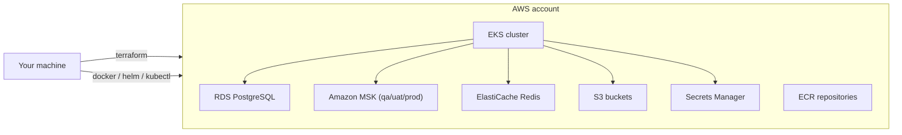

# AWS Deployment Guide

**Purpose.** The complete, step-by-step path from a brand-new AWS account to a production-ready
Amazon EKS deployment of Integrity Pro. Follow the documents in order — each builds on the
previous one.

## The 20 steps at a glance

| Step | Document | You end up with |
|---|---|---|
| 01 | [01-create-aws-account.md](01-create-aws-account.md) | A billing-ready AWS account with a root login |
| 02 | [02-create-iam-user.md](02-create-iam-user.md) | An admin IAM user (not root) + MFA |
| 03 | [03-configure-aws-cli.md](03-configure-aws-cli.md) | A working `aws` CLI on your machine |
| 04 | [04-install-terraform.md](04-install-terraform.md) | Terraform 1.9.x installed |
| 05 | [05-install-kubectl.md](05-install-kubectl.md) | kubectl installed |
| 06 | [06-install-helm.md](06-install-helm.md) | Helm 3 installed |
| 07 | [07-bootstrap-terraform-backend.md](07-bootstrap-terraform-backend.md) | S3 state bucket + DynamoDB lock table |
| 08 | [08-provision-aws-infrastructure.md](08-provision-aws-infrastructure.md) | VPC, EKS, RDS, MSK, ElastiCache, S3, secrets |
| 09 | [09-build-docker-images.md](09-build-docker-images.md) | 19 Docker images built locally |
| 10 | [10-push-images-to-ecr.md](10-push-images-to-ecr.md) | Images pushed to ECR |
| 11 | [11-install-strimzi.md](11-install-strimzi.md) | Strimzi Kafka operator (dev/local) |
| 12 | [12-deploy-kafka.md](12-deploy-kafka.md) | Kafka topics live (Strimzi or MSK) |
| 13 | [13-deploy-postgresql.md](13-deploy-postgresql.md) | PostgreSQL databases provisioned |
| 14 | [14-deploy-redis.md](14-deploy-redis.md) | Redis provisioned |
| 15 | [15-deploy-services.md](15-deploy-services.md) | All 19 services running in EKS |
| 16 | [16-deploy-ingress.md](16-deploy-ingress.md) | Ingress-nginx + ALB front door |
| 17 | [17-verify-platform.md](17-verify-platform.md) | End-to-end verification passed |
| 18 | [18-configure-domain.md](18-configure-domain.md) | Your domain points at the platform |
| 19 | [19-enable-https.md](19-enable-https.md) | TLS/HTTPS end to end |
| 20 | [20-production-checklist.md](20-production-checklist.md) | Security/compliance review signed off |

## Deployment topology recap

## Which data plane does my environment use?

| Environment | Kafka | PostgreSQL | Redis | Object storage | Email |
|---|---|---|---|---|---|
| `dev` | Strimzi (in-cluster) | Postgres (in-cluster) | Redis (in-cluster) | MinIO (in-cluster) | Mailpit |
| `qa` | **MSK** | **RDS** | **ElastiCache** | **S3** | SES |
| `uat` | **MSK** | **RDS multi-AZ** | **ElastiCache** | **S3** | SES |
| `prod` | **MSK** | **RDS multi-AZ** | **ElastiCache** | **S3** | SES |

Steps 11–14 differ depending on the target environment. Each document says which environments it
applies to.

## Naming conventions used throughout

| Placeholder | Meaning |
|---|---|
| `ACCOUNT_ID` | Your 12-digit AWS account ID (`123456789012`) |
| `ENV` | One of `dev`, `qa`, `uat`, `prod` |
| `PROJECT` | `integrity` (the project code, matches the S3 state key prefix) |
| `DOMAIN` | The public domain you own (e.g. `example.com`) |
| `REGION` | `us-east-1` (the default in all Terraform roots) |

## Golden rules for the whole series

1. **Run every command from the repository root** unless the step says otherwise.
2. **Never run `terraform apply` without reviewing the plan first.**
3. **Never commit `terraform.tfvars`, `.terraform`, `*.tfstate`, or `.env`** — they are ignored.
4. **Use the IAM user from step 02, not root, for everything.**
5. **Test each step's verification before moving on** — a silent failure at step 08 costs hours
   later.

## Where the manual work ends

After step 10 the GitHub Actions workflows (`ci.yml`, `terraform.yml`, `deploy.yml`) take over for
**routine** changes. The manual steps exist to bootstrap the first deployment; the pipelines then
own the steady state. See [`deployment.md`](../architecture/deployment.md) for the pipeline
architecture.
