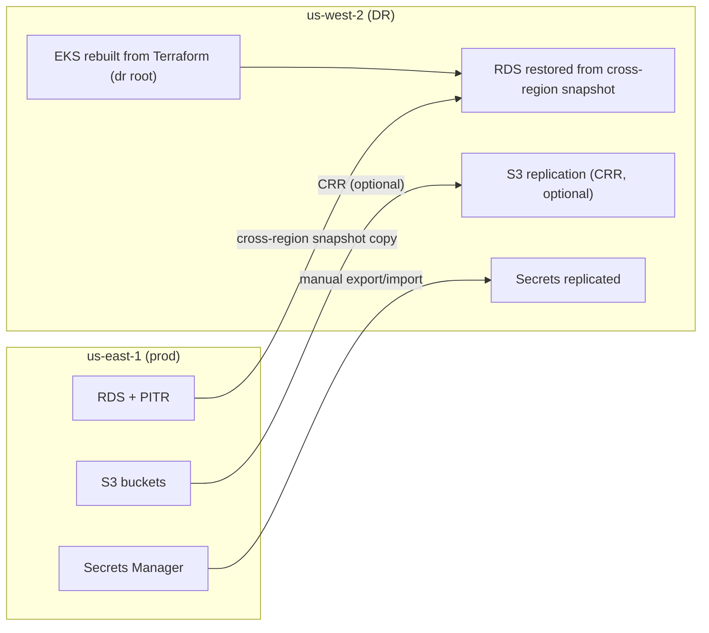

# Backup and Disaster Recovery

**Purpose.** To document how Integrity Pro is backed up, how to restore, and the recovery
objectives (RTO/RPO) you commit to. This is the strategic companion to the
[`runbooks/backup-restore.md`](runbooks/backup-restore.md) tactical runbook.

## 1. What needs backing up

| Data | Where | Backup mechanism |
|---|---|---|
| All 16 service databases | PostgreSQL (RDS prod; in-cluster dev) | RDS automated snapshots + PITR; dev: StatefulSet volume (EBS snapshot) |
| Object storage | S3 (`documents`, `reports`, `uploads`) | S3 versioning (native) |
| Kafka events | MSK (prod) / Strimzi (dev) | Retention-based (not backed up; replayable from producers) |
| Redis | ElastiCache / in-cluster | Cache only — **no backup needed** (rebuilds from DB) |
| Terraform state | S3 `integrity-terraform-state` | S3 versioning (native) |
| Application config / chart | Git | Git itself |
| Secrets | AWS Secrets Manager | Native versioning (previous values retrievable) |

> **Rule:** durable data = PostgreSQL + S3 + Git + Secrets Manager. Everything else is
> rebuildable.

## 2. RDS backups

### Automated snapshots

- Frequency: daily during the backup window (set via Terraform `db_backup_window`).
- Retention: `db_backup_retention_days` (prod ≥ 7 days).
- Location: stored in AWS, region-local (or cross-region if the DR plan requires it).

```bash
aws rds describe-db-instances --query \
  'DBInstances[].{DB:DBInstanceIdentifier,Retention:BackupRetentionPeriod,Window:PreferredBackupWindow,Latest:PITR:LatestRestorableTime}' \
  --output table
```

### Manual snapshots

Take one before any risky operation (upgrade, migration, decommission):

```bash
aws rds create-db-snapshot \
  --db-instance-identifier integrity-<env> \
  --db-snapshot-identifier integrity-<env>-pre-<change>-<timestamp>
```

## 3. Point-in-Time Recovery (PITR)

PITR restores to any second within the retention window by replaying transaction logs on top of
the daily snapshot.

- **RPO ceiling**: bounded by the backup retention window (7+ days). If you delete data at 09:00
  and the retention is 7 days, you can restore to 08:59 the same day.
- **RPO floor**: transaction logs give second-level granularity; realistically you recover to
  within ~5 minutes of the event.

```bash
# Restore to a specific UTC time
aws rds restore-db-instance-to-point-in-time \
  --source-db-instance-identifier integrity-prod \
  --target-db-instance-identifier integrity-prod-pitr \
  --restore-time 2026-08-03T09:59:00Z
```

Always restore to a **new instance**; never overwrite the source until verified.

## 4. S3 versioning

Versioning keeps every object revision, including delete markers.

```bash
aws s3api get-bucket-versioning --bucket integrity-<env>-documents
# {"Status": "Enabled"}
```

- Overwrites become new versions (RPO: near-zero for object stores).
- Deletions become delete markers — the object is recoverable.
- Lifecycle rules (optional) expire old versions after N days to control cost — set them
  deliberately so recovery is still possible within the retention you need.

## 5. Database restore procedure (summary)

1. Identify the restore point (snapshot or PITR time).
2. Restore to a new instance (`runbooks/backup-restore.md` §2).
3. Point the app config at the restored endpoint (ConfigMap) and rollout.
4. Verify data + Flyway schema integrity.
5. Keep the original instance until confidence is high; then decommission it (if it was
   corrupted, consider snapshotting it first for forensics).

## 6. Disaster recovery plan

### Scenarios and objectives

| Scenario | Objective | Procedure |
|---|---|---|
| Single AZ / node loss | RPO 0, RTO minutes | Multi-AZ RDS + node spread; autoscaler heals |
| Single service regression | RPO 0 | Rollback (`runbooks/service-rollback.md`) |
| Database corruption | RPO ≤ 5 min, RTO ≤ 1 h | PITR to a new instance |
| Accidental object deletion | RPO ~0 | S3 version restore |
| **Region loss** | **RPO ≤ 1 day, RTO ≤ 24 h** | Cross-region recovery below |
| Terraform state loss | RPO 0 (versioned) | Restore the state bucket version; keep a local `terraform.tfstate` copy as last resort |

### Region loss (DR for prod)

If the whole `us-east-1` region fails, recovery is **warm standby of data + rebuild of
compute**:



Recovery steps:

1. Restore the latest cross-region RDS snapshot (copied automatically by a scheduled task or
   Terraform's RDS `replicate_source_db`).
2. Re-apply a DR Terraform root (`terraform/environments/dr`) that recreates the cluster and
   points at the restored data.
3. Re-point DNS (Route 53 failover record) to the DR ALB.
4. Re-materialize secrets from the replicated Secrets Manager.

**RTO/RPO for region loss:**

- **RPO ≤ 1 day**: the last cross-region snapshot (tune frequency if you need tighter).
- **RTO ≤ 24 h**: restore + rebuild + DNS cutover, rehearsed.

### Rehearsals

- **Quarterly**: restore drill (snapshot → new instance → verify → discard).
- **Yearly**: full region-loss simulation in a scratch account.
- Every drill: record actual RTO/RPO and compare with targets; adjust if missed.

## 7. Recovery time / point objectives (targets)

| Environment | RPO | RTO |
|---|---|---|
| dev | n/a (rebuildable) | < 2 h |
| qa | ≤ 1 day | < 4 h |
| uat | ≤ 1 day | < 4 h |
| prod (data) | ≤ 5 min (PITR) | ≤ 1 h (restore) |
| prod (region loss) | ≤ 1 day | ≤ 24 h |

These are **targets**, not guarantees — confirm them with a drill, and tune the backup frequency,
cross-region copy interval, and DR tooling until the drill meets them.

## 8. Verification checklist

- [ ] RDS `BackupRetentionPeriod` matches policy (≥ 7 prod)
- [ ] `LatestRestorableTime` within the last hour
- [ ] S3 versioning enabled on all three buckets
- [ ] Manual snapshot exists before each risky change
- [ ] Cross-region snapshot copy scheduled (prod)
- [ ] Restore drill completed this quarter with measured RTO/RPO
- [ ] Terraform state bucket versioned and KMS-encrypted
